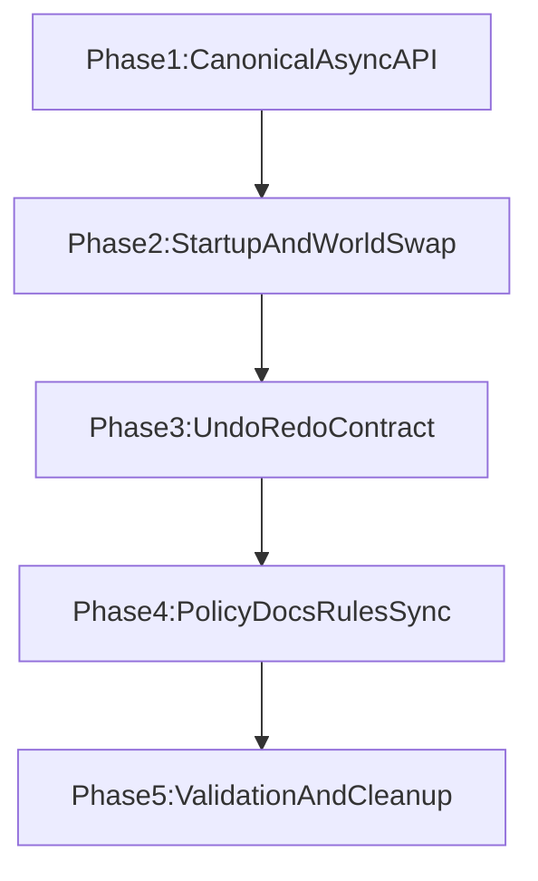

# Async-First Terrain Rebuild Migration Plan

## Goal

Move terrain full rebuild behavior from blocking main-thread sync calls to an async-first flow, while preserving deterministic world lifecycle ordering and adding explicit, documented exceptions.

## Scope

- Runtime code migration for full-world rebuild callers that currently depend on sync semantics.
- Completion/progress contracts for startup, world swap, and undo/redo.
- Canonical architecture and rules updates so future work defaults to async-first behavior.

## Current Baseline (What Exists)

- Sync full rebuild API exists in `[src/rendering/TerrainSurfaceRenderer.ts](src/rendering/TerrainSurfaceRenderer.ts)` (`rebuild(cameraPos?)`).
- Async chunk pipelines already exist and are reused by localized/dirty updates in `[src/rendering/TerrainSurfaceRenderer.ts](src/rendering/TerrainSurfaceRenderer.ts)` and `[src/meshing/MeshWorkerPool.ts](src/meshing/MeshWorkerPool.ts)`.
- Full rebuild callsites relying on sync semantics:
  - `[src/core/WorldInit.ts](src/core/WorldInit.ts)`
  - `[src/core/WorldSwap.ts](src/core/WorldSwap.ts)`
  - `[src/editor/TerrainEditor.ts](src/editor/TerrainEditor.ts)`
  - `[src/core/HistoryStore.ts](src/core/HistoryStore.ts)`
  - Collapse-heatmap debug path in `[src/systems/RockCollapseSystem.ts](src/systems/RockCollapseSystem.ts)`

## Migration Strategy

## Phase 1: Canonical Async Full-Rebuild API

- Introduce a single canonical async full-rebuild entrypoint in `[src/rendering/TerrainSurfaceRenderer.ts](src/rendering/TerrainSurfaceRenderer.ts)` that callers can await.
- Define completion semantics clearly:
  - When promise resolves, all required chunk results for that rebuild generation are applied.
  - Stale in-flight work is ignored via generation/world identity guards.
- Keep a narrow sync fallback path for explicit exception scenarios (worker unhealthy/unsupported, deterministic emergency transition).
- Ensure only one active full-rebuild session at a time (cancel/supersede older requests).

## Phase 2: Startup + World Swap Conversion

- Convert startup flow in `[src/core/WorldInit.ts](src/core/WorldInit.ts)` to await async full rebuild and report progress through existing loading UI hooks.
- Convert world swap flow in `[src/core/WorldSwap.ts](src/core/WorldSwap.ts)` to async ordering:
  - reset world state
  - renderer world rebind
  - await full terrain rebuild milestone
  - rewire dependent runtime systems
  - deferred plugin restore as needed
- Preserve deterministic order required by current world-restore contract.

## Phase 3: Undo/Redo Contract Migration

- Decide and implement one contract for terrain undo/redo in:
  - `[src/editor/TerrainEditor.ts](src/editor/TerrainEditor.ts)`
  - `[src/core/HistoryStore.ts](src/core/HistoryStore.ts)`
- Preferred: async-aware command execution with UI gating while terrain rebuild is in progress.
- Requirements:
  - prevent overlapping undo/redo terrain rebuild races
  - preserve command ordering guarantees
  - notify plugins only after rebuild completion for that command state

## Phase 4: Rules + Documentation Policy (Canonical-First)

- Canonical policy update in `[docs/engine/Engine_Architecture.md](docs/engine/Engine_Architecture.md)`:
  - Add an async-first terrain rebuild policy section.
  - Define explicit exceptions for immediate/sync behavior.
  - Define migration rule: new terrain fanout must use dispatcher policy; legacy sync-first paths must be removed when touched.
- Rule enforcement update in `[ .cursor/rules/engine-architecture.mdc](.cursor/rules/engine-architecture.mdc)`:
  - Add concise enforcement bullet pointing to canonical policy and exceptions.
- Router ownership update in `[.cursor/rules/llm.mdc](.cursor/rules/llm.mdc)`:
  - Add ownership row for async-first terrain rebuild policy canonical source.
- No-change verification (unless contradictions discovered) for:
  - `[.cursor/rules/immersive-editor.mdc](.cursor/rules/immersive-editor.mdc)`
  - `[.cursor/rules/migration-and-terminology.mdc](.cursor/rules/migration-and-terminology.mdc)`
  - `[.cursor/rules/simulation-backing-boundaries.mdc](.cursor/rules/simulation-backing-boundaries.mdc)`
  - `[.cursor/rules/typescript-typing.mdc](.cursor/rules/typescript-typing.mdc)`
  - `[docs/editor/Immersive_Editor_Principles.md](docs/editor/Immersive_Editor_Principles.md)`

## Phase 5: Validation and Risk Controls

- Add timing instrumentation gates around full rebuild sessions and apply-drain completion.
- Verify no frame-freeze regressions in:
  - startup load
  - world swap/load
  - terrain undo/redo bursts
  - collapse-heatmap toggle path
- Run architecture consistency checks so no contradictory policy language remains across:
  - `[llms.txt](llms.txt)`
  - `[.cursor/rules/*.mdc](.cursor/rules/)`
  - `docs/**/*.md`

## Acceptance Criteria

- Full terrain rebuild no longer blocks main thread in primary user flows.
- Startup/world-swap/undo terrain state remains deterministic and race-free.
- One canonical async-first policy exists with explicit, minimal exceptions.
- Rules and references are synchronized with no conflicting guidance.

