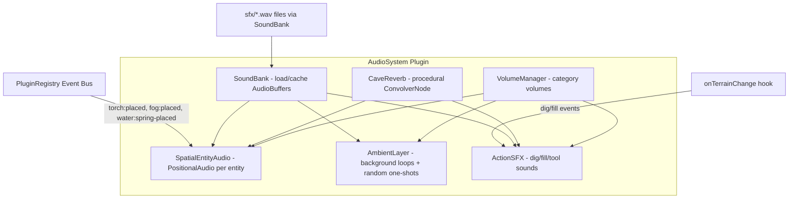

# Audio System Integration

## Current State

- [AudioSystem.ts](src/systems/AudioSystem.ts) exists as a plugin, but uses **procedural synthesis only** (oscillators + noise). No .wav files are loaded.
- 259 .wav files exist in [sfx/](sfx/) organized into: `Environment/`, `Footsteps/`, `Doors/`, `Battle_Damage_Interaction/`, `Items/`, `Magic/`, `Interface/`, `Environment/REGN/`.
- Entity events are already emitted by TorchSystem (`torch:placed`/`torch:removed`), FogEmitterSystem (`fog:placed`/`fog:removed`), WaterSystem (`water:spring-placed`/`water:spring-removed`).
- DiggingSystem only broadcasts `notifyTerrainChange()` -- no dedicated dig/fill sound events.
- No `public/` directory exists; sfx files need to be made web-accessible.

## Architecture




## SFX File Mapping

**Spatial entity sounds (3D positioned, looping):**

- Torch fire: `sfx/Environment/fire_trch.wav`
- Fog/wind hiss: `sfx/Environment/cave_wind.wav`
- Water spring: `sfx/Environment/watr_trikl.wav`

**Digging action sounds (one-shot, randomized):**

- Rock impact variants: `sfx/Environment/REGN/rocks1.wav` through `rocks8.wav`

**Ambient cave layers (non-spatial, quiet background):**

- Cave ambience: `sfx/Environment/bm_amb00.wav`, `bm_amb01.wav`, `bm_amb02.wav`
- Random one-shot drips: `sfx/Environment/cave_drip.wav`
- Distant wind: `sfx/Environment/REGN/wndCALM.wav` through `wndCALM5.wav`

**UI sounds (non-spatial, immediate):**

- Menu click: `sfx/Interface/menu click.wav`
- Tool switch: `sfx/Interface/menu swap.wav`

## Detailed Changes

### 1. Create `public/sfx/` (move assets)

Move the entire `sfx/` directory to `public/sfx/` so Vite serves them correctly both in dev and production builds. All audio URLs become `/sfx/Environment/fire_trch.wav` etc.

### 2. Rewrite `AudioSystem.ts`

Complete rewrite replacing procedural synthesis with sample-based audio. Key modules inside the file:

- **SoundBank**: async loader with LRU cache for `AudioBuffer` objects. Preloads a small set on init (entity loops, dig hits), loads others on demand. Uses `fetch()` + `decodeAudioData()`.
- **CaveReverb**: creates a procedural impulse response buffer (exponential decay ~1.5s, shaped like a medium cave) and applies it via `ConvolverNode`. Connected as a send bus -- entity and action sounds route a wet signal through it.
- **VolumeManager**: five `GainNode` buses: Master -> { Ambient, Entity, Action, UI }. Each has a 0-1 volume. Persisted via `getSaveData()`/`loadSaveData()`.
- **SpatialEntityAudio**: on `torch:placed` etc., creates a `THREE.PositionalAudio` with the appropriate looping .wav buffer. Distance model: inverse with `refDistance=5`, `maxDistance=60`, `rolloffFactor=1.5` (matching current values). Random slight pitch variation per instance (0.95-1.05) for natural feel.
- **AmbientLayer**: plays 1-2 quiet background loops (`bm_amb00.wav` cross-faded) through the Ambient bus. Schedules random one-shot cave drips at varying intervals (2-8s). Uses non-positional `THREE.Audio`.
- **ActionSFX**: subscribes to a new `digging:impact` event (emitted by DiggingSystem). Plays a random `rocks*.wav` variant. Rate-limited to ~100ms between hits to avoid sound spam.

Expose InspectRegistry properties per entity audio instance:

- **Volume** (slider, 0-1, per-entity override)
- **Radius** (slider, 5-100, sets refDistance/maxDistance)
- **Pitch** (slider, 0.5-2.0)

### 3. Add digging sound events to `DiggingSystem.ts`

At each `pluginRegistry.notifyTerrainChange()` call site (6 locations), also emit:

```typescript
pluginRegistry.emit('digging:impact', {
  position: new THREE.Vector3(x, y, z),
  radius: brushRadius,
  action: 'dig' | 'fill' | 'smooth' | 'flatten',
});
```

This is a minimal addition (~6 lines total) that the AudioSystem subscribes to.

### 4. Add audio settings to `index.html`

New settings section in the escape menu (under "Cave Atmosphere"), styled to match the grimdark aesthetic:

- **Audio** section label
- Master Volume slider (0-100%)
- Ambient Volume slider
- Entity Sounds Volume slider
- Action Sounds Volume slider
- Mute toggle checkbox

### 5. Wire settings in `main.ts`

Add event listeners for the new audio sliders, calling exported setter functions from `AudioSystem.ts`. Add `M` hotkey for global mute toggle.

### 6. Save/Load persistence

`AudioSystem` implements `getSaveData()` / `loadSaveData()` returning:

```typescript
{ key: 'audio', data: { master: 0.4, ambient: 0.3, entity: 0.5, action: 0.6, ui: 0.5, muted: false } }
```

### 7. InspectRegistry integration for entity audio

When a spatial audio source is created for an entity (torch, fog, spring), register additional properties on the entity's `InspectableEntity.getProperties()` return value. This requires coordination with TorchSystem/FogEmitterSystem/WaterSystem -- AudioSystem will listen for the same events and augment the entity's property list via the InspectRegistry.

## Key Design Decisions

- **Sample-based over procedural**: Real .wav files from the sfx library provide far richer, more immersive sound than synthesized noise. Procedural generation is removed entirely.
- **Cave reverb via procedural impulse response**: No external reverb IR file needed. We generate a ~1.5s exponential decay buffer that simulates a medium underground chamber.
- **Rate-limited action sounds**: Digging can fire many terrain changes per second; action SFX is throttled to prevent audio spam.
- **Lazy loading with preload set**: Only ~10 essential sounds are preloaded on first user gesture. Others load on demand.
- **Plugin-compliant**: Single plugin, self-registering, enable/disable support, save/load, no imports from other plugins.

