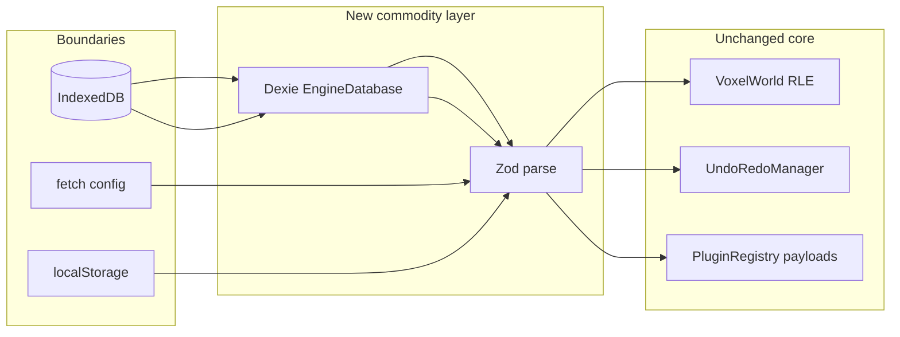

# Commodity layers: full integration (non-UI, non-multiplayer)

## Out of scope (explicit)

- **React / dockview / Monaco / Zustand** — follow [react_editor_ui_migration_250a2e13.plan.md](.cursor/plans/react_editor_ui_migration_250a2e13.plan.md) first; this plan does not move `[UILayoutStore](src/ui/UILayoutStore.ts)` or panels.
- **Renderer, voxel core, WASM workers, Rapier integration** — unchanged.
- **Multiplayer / realtime networking** — not included.

## Current legacy (what we replace or wrap)

| Area              | Today                                                                                                                                                                                                           | Target                                                                                                                                                                           |
| ----------------- | --------------------------------------------------------------------------------------------------------------------------------------------------------------------------------------------------------------- | -------------------------------------------------------------------------------------------------------------------------------------------------------------------------------- |
| IndexedDB         | Duplicate `openDB()` in `[ChunkStore.ts](src/core/ChunkStore.ts)` and `[HistoryStore.ts](src/core/HistoryStore.ts)`, same `DB_NAME` / `DB_VERSION`                                                              | Single **Dexie** database module with versioned `upgrade` migrations                                                                                                             |
| Save/load trust   | Plain objects from IDB / `fetch().json()`                                                                                                                                                                       | **Zod** parse at boundaries (safe defaults + logged failures)                                                                                                                    |
| `fetchConfig`     | Unchecked `T`                                                                                                                                                                                                   | Parse with schema per config URL or shared `JsonRecord` + per-call schema                                                                                                        |
| localStorage      | Many ad-hoc keys (`[PluginPrewarmCoverage](src/core/PluginPrewarmCoverage.ts)`, `[ToolPalette](src/editor/ToolPalette.ts)`, `[SettingsEffectKnobsFoldStorage](src/ui/SettingsEffectKnobsFoldStorage.ts)`, etc.) | Typed **pref modules** (Zod read/write); UILayout can stay as-is until React migration touches it                                                                                |
| E2E               | None ([no Playwright config](glob search))                                                                                                                                                                      | **Playwright** smoke against `vite preview`                                                                                                                                      |
| Production errors | Console only                                                                                                                                                                                                    | **Sentry** (`@sentry/browser` + Vite plugin), env-gated                                                                                                                          |
| Audio             | Custom graph + `[AudioSoundBank](src/systems/AudioSoundBank.ts)`                                                                                                                                                | **No Howler for spatial 3D** (would fight `THREE.PositionalAudio` / listener routing). Add **Zod-validated** `SoundDef` / manifest parsing; keep existing Web Audio + Three path |

## Architecture: adapter + schemas

- **Single source of truth** for DB: new module e.g. `[src/persistence/EngineDatabase.ts](src/persistence/EngineDatabase.ts)` (Dexie subclass) exporting table accessors used by thin wrappers.
- **ChunkStore / HistoryStore**: keep **public function names** (`saveWorld`, `loadWorld`, `loadWorldStream`, `saveHistory`, `loadHistory`, etc.) so call sites in `[WorldInit](src/core/WorldInit.ts)`, `[EditorUI](src/ui/EditorUI.ts)`, tests stay stable; implementation delegates to Dexie + Zod.
- **World plugin payload**: extend `[WorldPluginPayload.types.ts](src/core/WorldPluginPayload.types.ts)` usage with a **Zod schema** that allows known `__`* keys and `z.record(z.string(), z.unknown())` for plugin keys (same flexibility as today, with runtime checks).

## Implementation phases

### 1) Dependencies and tooling

- Add **runtime**: `zod`, `dexie`.
- Add **dev**: `@playwright/test`, `@sentry/vite-plugin` (and `@sentry/browser` as runtime dep for init).
- **Sentry**: `SENTRY_AUTH_TOKEN` / org / project only in CI or local release builds; `enabled: !!import.meta.env.VITE_SENTRY_DSN` pattern in a tiny `[src/telemetry/sentryInit.ts](src/telemetry/sentryInit.ts)` imported from bootstrap (e.g. entry after VibeEngine safe point). Document required env vars in `[llms.txt](llms.txt)` (canonical map row).

### 2) Dexie migration (legacy-compatible)

- Implement `EngineDatabase` with `version(2)` matching current stores (`worlds`, `history` — mirror existing `keyPath: 'name'`).
- **Bump DB version** only if schema shape changes; if only code path changes, keep version 2 and swap implementation under the same version (Dexie + same object stores).
- Move all `indexedDB.open` / transaction code out of `[ChunkStore.ts](src/core/ChunkStore.ts)` and `[HistoryStore.ts](src/core/HistoryStore.ts)`.
- Preserve timing/debug `[emitCursorDebugEvent](src/debug/CursorDebugTransport.ts)` calls where they matter for save/load observability.

### 3) Zod schemas

- New folder e.g. `[src/schemas/persistence/](src/schemas/persistence/)`: `StoredWorldSchema`, `StoredHistorySchema` (mirror `[SerializedCommand](src/core/HistoryStore.ts)` types — export minimal types from schema inference via `z.infer`).
- `WorldPluginPayloadSchema`: loose enough for plugin keys; strict for `__camera`, `__sessionMode`, etc.
- `fetchConfig`: overload or generic `fetchConfig(url, schema, fallback)` in `[ConfigPersistence.ts](src/core/ConfigPersistence.ts)`; migrate each caller to pass a schema (incremental file-by-file if large).

### 4) localStorage prefs (non-UI layout)

- Add small helpers e.g. `readJsonPref(key, schema, fallback)` / `writeJsonPref` to dedupe parse/stringify.
- Migrate: `[PluginPrewarmCoverage](src/core/PluginPrewarmCoverage.ts)`, `[ToolPalette](src/editor/ToolPalette.ts)`, `[SettingsEffectKnobsFoldStorage](src/ui/SettingsEffectKnobsFoldStorage.ts)`, `[TorchShadowCache](src/core/TorchShadowCache.ts)` (as applicable), `[PerformanceMonitor](src/core/PerformanceMonitor.ts)` flags — **without** changing behavior.
- **Skip** `[UILayoutStore](src/ui/UILayoutStore.ts)` in this PR if React migration will replace it soon (per your plan); if touched, keep API identical.

### 5) Audio: validation only (no Howler for spatial)

- Add `SoundDefSchema` aligned with `[SoundDef](src/systems/AudioSoundBank.ts)`; validate manifest at startup (dev: throw or warn; prod: filter invalid entries).
- Document in plan deliverable: **Howler deferred** until a clear non-spatial use case (e.g. UI-only sounds after React) to avoid two audio engines.

### 6) Playwright

- Add `playwright.config.ts` (baseURL `http://127.0.0.1:4173` or configurable), `e2e/smoke.spec.ts`: start not required in config if using `webServer: { command: 'npm run build && npm run preview', ... }` or document `preview` in CI.
- One smoke path: load page, assert canvas `#game-canvas` (or existing root selector from `[index.html](index.html)`), no fatal console (optional strictness).
- Add npm script `test:e2e` / `verify` chain update in `[package.json](package.json)`.

### 7) Tests and verification

- Update `[tests/chunk-store.test.ts](tests/chunk-store.test.ts)` — still `fake-indexeddb/auto`; Dexie works with it (verify in CI).
- Add Zod roundtrip unit tests for worst-case payloads (plugin blob, history stacks).
- Run **architecture-and-docs** pass: update `[llms.txt](llms.txt)` persistence table (Dexie + Zod boundaries, Sentry env).
- Run **migration-and-terminology** pass: no duplicate canonical names for save format; if `StoredWorld` fields change, document migration version bump.

### 8) Sentry (included per your choice)

- Vite: wire `@sentry/vite-plugin` in `[vite.config.ts](vite.config.ts)` for production builds with source maps upload when token present; no-op when missing.
- Runtime: init once; scrub PII if any user paths in future; `beforeSend` filter for dev noise if needed.

## Risk controls

- **Data loss**: ship Dexie path behind the same keys; run existing ChunkStore tests + manual Continue/autosave check.
- **Performance**: Dexie adds minimal overhead vs raw IDB; keep large RLE blobs unchanged.
- **Bundle size**: Zod + Dexie + Sentry — acceptable; tree-shake Sentry lazy init if desired later.

## Recommended post-implementation agent passes (human workflow)

- **architecture-and-docs**: `llms.txt` + drift checkers.
- **test-runner**: `vitest` + Playwright locally/CI.
- **verifier**: playtest autosave/Continue + hitch logs unchanged.

