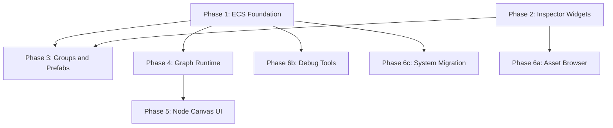

# Full Implementation Plan: ECS, Visual Scripting, Groups, Inspector, Assets, Debug, RPG

## Dependency Graph

---

## Phase 1 — ECS Foundation Wiring

**Goal:** Make ComponentRegistry and EntityManager live in the running engine. Pilot-migrate TorchSystem. Add a "Components" section to InspectorPanel.

### 1.1 Bootstrap registries at startup

**File:** [src/core/WorldInit.ts](src/core/WorldInit.ts)

- Import `componentRegistry`, `entityManager` from `ComponentRegistry.ts`
- Import `registerBuiltinRPGComponents` from `RPGComponents.ts`
- In the WorldInit system (after renderer is ready), call:
  - Register the 4 built-in components (Transform, Interactable, Flammable, PhysicsBody) — they are defined but never registered
  - `registerBuiltinRPGComponents()` — fix the `require()` call to a normal import
- Wire `entityManager.getSaveData()` and `loadSaveData()` into the persistence pipeline alongside `pluginRegistry.gatherSaveData()`

### 1.2 Complete EntityManager TODO stubs

**File:** [src/core/ComponentRegistry.ts](src/core/ComponentRegistry.ts)

- `createEntity()`: add `inspectRegistry.register(...)` call, build an `InspectableEntity` whose `getProperties()` aggregates all attached component `getProperties()` and whose `getSummary()` aggregates all component `getSummary()`. Emit `entity:created` via `pluginRegistry.emit()`
- `destroyEntity()`: add `inspectRegistry.unregister(id)` and emit `entity:destroyed`
- `attachComponent()`: emit `component:attached` and refresh InspectRegistry entry (re-register to update getProperties)
- `detachComponent()`: emit `component:detached` and refresh InspectRegistry entry
- Fix circular dependency: `pluginRegistry` and `inspectRegistry` will need to be imported. Use lazy imports or a late-binding pattern (e.g., `setPluginRegistry()` called from WorldInit)

### 1.3 "Components" section in InspectorPanel

**File:** [src/ui/InspectorPanel.ts](src/ui/InspectorPanel.ts)

- When opening entity mode (`openEntityMode` or `openNPCMode`), check if the entity ID exists in `entityManager`
- If so, render a "Components" collapsible subsection below the plugin-specific properties:
  - List attached components with icon + label + remove button
  - "Add Component" button that shows a categorized dropdown/palette of all registered ComponentDefs not yet attached
  - Each attached component renders its `getProperties()` as a nested collapsible group
- Undo/redo integration: `attachComponent` and `detachComponent` wrapped as UndoRedoManager commands

### 1.4 Pilot: TorchSystem migration

**File:** [src/systems/TorchSystem.ts](src/systems/TorchSystem.ts)

- In `placeTorch()`, after creating the torch group, also call `entityManager.createEntity('torch-system', group)` and `entityManager.attachComponent(id, 'transform', ...)` + `entityManager.attachComponent(id, 'flammable', { fuel: ... })`
- The system's own `TorchEntry` array remains (systems keep their internal state for performance); EntityManager acts as a parallel ECS view
- In `removeTorchById()`, also call `entityManager.destroyEntity(entityId)`
- The `buildTorchInspectable()` function should delegate to EntityManager's auto-generated InspectableEntity for the component properties, while keeping plugin-specific properties (light color, intensity, etc.) as before

### 1.5 Component Gizmos

**File:** [src/ui/Gizmos.ts](src/ui/Gizmos.ts)

- When an entity is focused (`setFocusedEntity`), query `entityManager.getComponents(entityId)` and for each component that has `getGizmos()`, create the corresponding Three.js helpers (sphere, cylinder, etc.)
- Remove component gizmos when entity is unfocused

---

## Phase 2 — New Inspector Property Types

**Goal:** Implement the 5 missing PropertyDef types so RPG components and advanced properties render properly.

### 2.1 Readonly property

**File:** [src/ui/InspectorPanel.ts](src/ui/InspectorPanel.ts) — add `case 'readonly':` in `appendControl()`

- Render a label + non-editable value span using `prop.displayValue ?? String(prop.value)`
- CSS class: `.panel-readonly-row`

### 2.2 Progress property

- Render a label + progress bar (HTML `<progress>` or styled `
`)
- Value is 0-1, bar fills proportionally
- Optional `prop.progressLabel` text overlay (e.g., "75 / 100 HP")

### 2.3 Array property

- Render a collapsible list of items
- Each item renders its `prop.arrayItemTemplate` properties recursively (call `appendControl` for each)
- "Add" button calls `prop.onAdd()`
- Per-item "Remove" button calls `prop.onRemove(index)`
- Drag handles for reorder calling `prop.onReorder(from, to)` (use HTML drag API or manual mousedown tracking)
- Undo/redo for add/remove/reorder

### 2.4 Curve property

- Render a small inline `<canvas>` (200x80px) showing the curve defined by `CurvePoint[]`
- Points are draggable control handles on the canvas
- On change, call `prop.onChange(newPoints)`
- Useful for animation easing, damage falloff, etc.

### 2.5 Asset property

- Render a label + current asset name + "Browse" button
- "Browse" opens a small inline picker that lists available assets filtered by `prop.assetType` ('model' | 'texture' | 'sound' | 'prefab' | 'graph')
- For now, populate from `ModelManifest` (models), `prefabRegistry` (prefabs), `behaviorGraphRegistry` (graphs)
- On select, call `prop.onChange(assetId)`

### 2.6 CSS

**File:** [src/styles/inspector.css](src/styles/inspector.css) — add styles for all 5 new control types matching existing design tokens (gold borders, parchment backgrounds, Crimson Text font)

---

## Phase 3 — Multi-Select, Groups, and Prefabs

**Goal:** Entity selection, grouping, and prefab creation/instantiation as in-world tools.

### 3.1 Multi-select

**File:** [src/editor/EntityHover.ts](src/editor/EntityHover.ts)

- Track a `Set<string>` of selected entity IDs
- Ctrl+E: toggle-select hovered entity (add/remove from selection set)
- E alone: single-select (clear set, select one)
- Highlight all selected entities (gold outline or persistent emissive boost)
- When multiple are selected, InspectorPanel shows "N entities selected" with shared properties

### 3.2 Wire EntityGroupManager

**File:** [src/core/WorldInit.ts](src/core/WorldInit.ts)

- Import `entityGroupManager`, `prefabRegistry` from `EntityGroup.ts`
- Wire `getSaveData()` / `loadSaveData()` into persistence pipeline

### 3.3 Group creation UI

**File:** [src/editor/EntityHover.ts](src/editor/EntityHover.ts) or new [src/editor/SelectionManager.ts](src/editor/SelectionManager.ts)

- When 2+ entities are selected, pressing G (or a new hotkey) calls `entityGroupManager.createGroup(label, selectedIds)`
- Undo/redo command for group creation/dissolution
- Group gizmo: bounding box wireframe around all child entities in Gizmos.ts

### 3.4 Group Inspector

**File:** [src/ui/InspectorPanel.ts](src/ui/InspectorPanel.ts)

- When inspecting a grouped entity, show a "Group" section:
  - Group name (editable text)
  - List of child entities (click to focus)
  - "Dissolve Group" button
  - "Save as Prefab" button
- When inspecting a group itself, allow transform-all children

### 3.5 Prefab system

**File:** [src/core/EntityGroup.ts](src/core/EntityGroup.ts) — implement `instantiatePrefab()`

- `savePrefab()` already captures `EntitySnapshot[]`; enhance to capture component data via `entityManager.getSaveData()` for each member
- `instantiatePrefab()`: for each snapshot, call `entityManager.createEntity()` and `attachComponent()` for every saved component, then `entityGroupManager.createGroup()` for the new instances
- Prefab palette: add a "Prefabs" category in `PaletteRegistry` that lists all saved prefabs; selecting one makes it the active "tool" for placement

---

## Phase 4 — Behavior Graph Runtime

**Goal:** Make behavior graphs executable. Signals fire, nodes evaluate, entities react.

### 4.1 BehaviorGraphRuntime class

**New file:** [src/core/BehaviorGraphRuntime.ts](src/core/BehaviorGraphRuntime.ts)

- `BehaviorGraphRuntime` class with:
  - `tick(dt: number)`: evaluate all active graphs
  - `fireSignal(graphId, nodeId, portId)`: trigger a signal port on a node
  - `fireEntitySignal(entityId, signalName, data?)`: fire a named signal on all graphs attached to an entity
  - `evaluateNode(graph, node, context)`: call `nodeDef.execute(context)` with a real `NodeExecutionContext`
  - Signal propagation: when a signal output fires, follow all connections to connected input ports and evaluate those destination nodes
- Singleton: `export const behaviorGraphRuntime = new BehaviorGraphRuntime()`

### 4.2 NodeExecutionContext implementation

**File:** [src/core/BehaviorGraphRuntime.ts](src/core/BehaviorGraphRuntime.ts)

- Implement `NodeExecutionContext` that:
  - `getInput(portId)`: reads from connected output ports via graph connections
  - `setOutput(portId, value)`: stores value for downstream nodes
  - `fireSignal(portId)`: queues signal propagation
  - `getComponentData(entityId, componentId)`: reads from `entityManager`
  - `setComponentData(entityId, componentId, data)`: writes to `entityManager`
  - `emitEvent(event, ...args)`: calls `pluginRegistry.emit()`
  - `delay(ms, callback)`: schedules delayed execution via `setTimeout` or frame-based timer

### 4.3 Wire node execute() callbacks

**File:** [src/core/BehaviorGraph.ts](src/core/BehaviorGraph.ts)

- Replace `noop` in all 14 built-in node defs with real implementations:
  - `OnInteractNode`: listens for `entity:interact` event, fires output signal
  - `OnDamageNode`: listens for `entity:damage` event
  - `EmitSignalNode`: calls `pluginRegistry.emit()` with a custom signal name
  - `PlayAnimationNode`: calls character animator or VFX system
  - `SetPropertyNode`: calls `entityManager` to update component data
  - `IfConditionNode`: evaluates boolean input, fires "then" or "else" signal
  - `DelayNode`: uses `context.delay()` to wait then fire
  - `SayDialogueNode`: emits `dialogue:line` event (UI picks up)
  - `ChoiceBranchNode`: emits `dialogue:choice` event, waits for response
  - `StartQuestNode` / `CompleteObjectiveNode` / `CheckObjectiveNode`: manipulate QuestGiver component data
  - `ListenSignalNode`: subscribes to custom signal events
  - `RandomNode`: outputs random number
  - `CompareNode`: compares two numeric inputs

### 4.4 Integrate into update loop

**File:** [src/core/WorldInit.ts](src/core/WorldInit.ts) or [src/systems/EditorSystem.ts](src/systems/EditorSystem.ts)

- In the main update loop (VibeEngine simulation group or pluginRegistry.broadcastUpdate), call `behaviorGraphRuntime.tick(dt)`
- Wire event listeners: when `entity:interact` fires (from EntityHover E-key), propagate to OnInteractNode triggers
- Wire persistence: `behaviorGraphRuntime.getSaveData()` / `loadSaveData()` alongside other systems

---

## Phase 5 — Behavior Graph Node Canvas UI

**Goal:** Full in-world visual node editor for wiring entity behaviors, quests, and dialogues.

### 5.1 Canvas overlay

**New file:** [src/ui/NodeCanvas.ts](src/ui/NodeCanvas.ts)

- HTML overlay with a `<canvas>` element (or SVG) that renders the node graph
- Triggered by pressing B while aiming at an entity (wired in EntityHover)
- Semi-transparent background, world-space anchored (or fixed screen overlay with entity context)
- Pointer lock released; mouse captures canvas interactions
- ESC or B again closes the canvas
- Register with PanelManager for drag/layout persistence

### 5.2 Node rendering

- Each `GraphNode` renders as a card:
  - Title bar (icon + label from `NodeDef`, colored by `NodeCategory`)
  - Input ports on the left, output ports on the right
  - Parameters (inline editable) below the title
  - Position tracked in `GraphNode.position` (2D canvas coordinates)
- Render connections as bezier curves between port positions
- Port type colors: signal = orange, number = blue, string = green, boolean = red, entity = purple, vec3 = cyan

### 5.3 Node palette sidebar

- Left sidebar in the canvas overlay
- Categorized list of all registered `NodeDef`s (grouped by `NodeCategory`)
- Search/filter bar at top
- Drag a node from palette onto canvas to create a `GraphNode` instance
- Or right-click canvas for context menu palette

### 5.4 Connection interaction

- Click and drag from an output port to an input port to create a `GraphConnection`
- Type validation: only connect compatible `PortValueType`s (signal-to-signal, number-to-number, any accepts all)
- Click a connection to select it; Delete key removes it
- Visual feedback: dragging connection shows a preview line following the mouse

### 5.5 Node parameter editing

- Inline parameter editing in node cards:
  - Number: small input field
  - String: text input
  - Boolean: checkbox
  - Dropdown: select from `NodeParamDef.options`
  - Entity: click to pick (enter select-entity mode, click an entity in the world)

### 5.6 Live preview and testing

- "Test" button on trigger nodes: manually fires the signal to preview the chain
- Animated connection lines during signal flow (pulse animation)
- Node highlights when executing (brief glow)

### 5.7 Signal gizmos between entities

**File:** [src/ui/Gizmos.ts](src/ui/Gizmos.ts)

- When gizmos are enabled (G key), render animated colored lines between entities that have signal connections
- Line color based on signal type; dashed for inactive, solid animated for active
- Uses Three.js `Line2` or `BufferGeometry` with animated dash offset

### 5.8 CSS and styling

**New file:** [src/styles/node-canvas.css](src/styles/node-canvas.css)

- Medieval/parchment theme consistent with existing UI tokens
- Node cards: dark panel with gold borders
- Ports: small circles with type-colored fills
- Connections: SVG paths or canvas curves
- Import in [src/styles/index.css](src/styles/index.css)

---

## Phase 6a — Asset Browser

**Goal:** In-game overlay for browsing and selecting assets (models, textures, sounds).

### 6a.1 Asset index

**New file:** [src/core/AssetIndex.ts](src/core/AssetIndex.ts)

- Scans `ModelManifest` for models
- Scans `public/` directory manifest for textures and sounds (generate a manifest at build time via Vite plugin or static JSON)
- Provides `getAssetsByType(type)`, `getAsset(id)`, `searchAssets(query)`

### 6a.2 Asset browser panel

**New file:** [src/ui/AssetBrowser.ts](src/ui/AssetBrowser.ts)

- HTML overlay panel (registered with PanelManager)
- Grid view of asset thumbnails (model previews from manifest, waveform for sounds, image preview for textures)
- Category tabs: Models, Textures, Sounds, Prefabs, Graphs
- Search bar with live filter
- Click to select (for use with `asset` property type in inspector)
- Drag-and-drop onto world to place (for models/prefabs)
- Hotkey: Tab or dedicated key to toggle

### 6a.3 Wire to inspector `asset` property

- The `asset` property type "Browse" button from Phase 2.5 opens the AssetBrowser in selection mode
- On select, returns asset ID to the property's `onChange` callback

---

## Phase 6b — Debug and Simulation Tools

**Goal:** In-world debugging overlays and time controls for testing complex interactions.

### 6b.1 Enhanced Debug HUD

**File:** [src/debug/DebugHUD.ts](src/debug/DebugHUD.ts)

- Add entity debug overlay: when debug mode is on (F3 or similar), show floating labels above entities with:
  - Entity ID, plugin, component list
  - Active behavior graph state (current executing node)
  - Component data summaries
- Performance: entity count, component count, active graph count

### 6b.2 Time controls

**File:** [src/core/VibeEngine.ts](src/core/VibeEngine.ts) or new [src/debug/TimeControls.ts](src/debug/TimeControls.ts)

- Pause/Resume: freeze `dt` to 0 (simulations stop, camera still moves)
- Slow motion: scale `dt` by 0.1x, 0.25x, 0.5x
- Step: advance exactly one frame while paused
- UI: small control bar at top of screen when debug mode is active

### 6b.3 Interaction tracer

**New file:** [src/debug/InteractionTracer.ts](src/debug/InteractionTracer.ts)

- When enabled, subscribes to all event bus events and logs them with timestamps
- Renders event flow as animated particles between source and target entities
- Toggle via debug panel or hotkey
- Log panel: scrollable list of recent events with entity IDs and data

---

## Phase 6c — System Migration to EntityManager

**Goal:** Migrate remaining ToolPlugin systems to create entities through EntityManager, enabling cross-system component interactions.

### Systems to migrate (same pattern as Phase 1.4 TorchSystem):

- [src/systems/FogEmitterSystem.ts](src/systems/FogEmitterSystem.ts) — attach Transform + custom FogEmitter component
- [src/systems/CharacterSystem.ts](src/systems/CharacterSystem.ts) — attach Transform + AI component + any RPG components
- [src/systems/PropSystem.ts](src/systems/PropSystem.ts) — attach Transform component
- [src/systems/VFXSystem.ts](src/systems/VFXSystem.ts) — attach Transform + VFX component
- [src/systems/WaterSystem.ts](src/systems/WaterSystem.ts) — attach Transform + WaterSpring component
- [src/systems/VegetationSystem.ts](src/systems/VegetationSystem.ts) — attach Transform + Vegetation component

### Migration pattern for each:

1. In placement function: call `entityManager.createEntity()` + `attachComponent()` for relevant components
2. In removal function: call `entityManager.destroyEntity()`
3. Keep system-internal arrays for performance-critical per-frame updates
4. EntityManager provides the cross-system query layer (e.g., "find all entities with Flammable near this fire VFX")

---

## Summary: Estimated Effort per Phase

| Phase | Description       | Scope                                              |
| ----- | ----------------- | -------------------------------------------------- |
| 1     | ECS Foundation    | ~5 files, medium complexity                        |
| 2     | Inspector Widgets | ~2 files, medium complexity                        |
| 3     | Groups/Prefabs    | ~5 files, medium-high complexity                   |
| 4     | Graph Runtime     | ~2 files, high complexity                          |
| 5     | Node Canvas UI    | ~3 new files, very high complexity (largest piece) |
| 6a    | Asset Browser     | ~2 new files, medium complexity                    |
| 6b    | Debug Tools       | ~3 files, medium complexity                        |
| 6c    | System Migration  | ~6 files, repetitive but straightforward           |

Phases 1 and 2 can run in parallel. After both complete, Phases 3, 4, and 6c can proceed. Phase 5 depends on Phase 4. Phase 6a depends on Phase 2. Phase 6b depends on Phase 1.