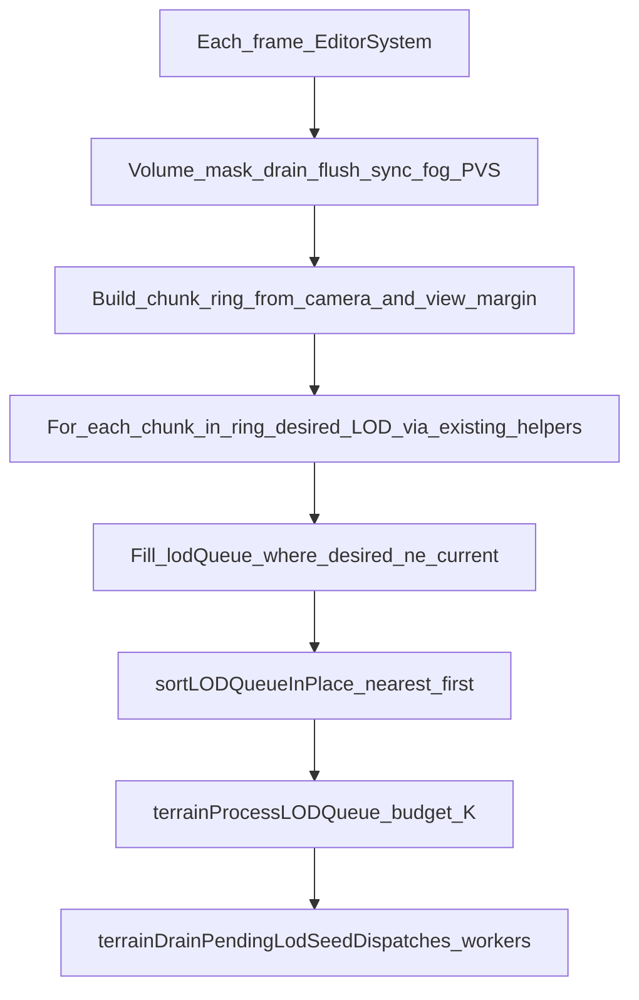

# Simple terrain chunk streaming loop (scheduling only, keep PVS)

## Goal

Implement a **single streaming policy** that matches the mental model you described: each frame (and on a **periodic timer** while idle), **reconcile** “chunks that should exist around the camera” with **distance-prioritized work** and a **fixed cap K** of LOD transitions, **without** starving updates until movement stops. **Chunk visibility rules stay as today** (occlusion / PVS + existing `terrainComputeChunkLODWithNear` / `[TerrainLodRuntime](src/rendering/terrain-surface/TerrainLodRuntime.ts)`) — per your choice we are **not** switching to distance-only Minecraft visibility.

## Current pain points (grounded in code)

- `[terrainUpdateLOD](src/rendering/terrain-surface/TerrainLodUpdate.ts)` combines: volume-mask drain, volume window sync, **PVS update**, **stationary vs moving grid** branch, **time-sliced full-grid scan** with **far decimation**, **prefetch/backfill** side queues, and `[terrainProcessLODQueue](src/rendering/terrain-surface/TerrainLodSeedPipeline.ts)`. The **stationary path** (lines ~146–175) only drains the existing `lodQueue` — it is easy to **under-queue** when the camera is classified as “not moving” during `streamRebuild` or when scans/decimation lag.
- `[EditorSystem](src/systems/EditorSystem.ts)` already calls `[TerrainSurfaceRenderer.updateLOD](src/rendering/TerrainSurfaceRenderer.ts)` every frame after load (with a dynamic budget). The missing piece is a **simpler, always-on reconciliation** that does not depend on velocity heuristics.

## Target behavior

- **Ring, not “whole world time-slice”**: Iterate chunk indices in a **bounding box** around the camera derived from existing distances (reuse `[terrainChunkBoundsAroundWorld](src/rendering/terrain-surface/TerrainLocalizedRebuild.ts)` with `margin ≈ rt._viewDist` or the same margin already implied by your LOD math). Map world `(cx,cy,cz)` through existing **infinite XZ** base-chunk mapping (`worldChunkBaseXZ`) the same way the current scan does (see `[TerrainLodUpdate](src/rendering/terrain-surface/TerrainLodUpdate.ts)` ~lines 288–295).
- **Desired LOD**: Keep `**terrainComputeChunkLODWithNear`** + `[getOcclusionNearRadii](src/core/OcclusionCulling.ts)` so **PVS stays authoritative** for `smooth` vs `hidden`.
- **Unload outside ring**: For chunks **inside the renderer’s finite chunk window** but **outside** the ring, enqueue `desired: 'hidden'` when `current !== 'hidden'` (same as today’s full scan, but scoped to “ring + eviction window” instead of exotic prefetch paths).
- **Cap K**: Continue using `lodTransitionBudget` / `MAX_LOD_TRANSITIONS_PER_FRAME` via existing `[terrainProcessLODQueue](src/rendering/terrain-surface/TerrainLodSeedPipeline.ts)` (and EditorSystem’s `lodBudgetChunksPerFrame`). No new “unlimited” mesh spam.
- **Idle / “not releasing WASD”**: Maintain `lastSimpleStreamingCheckAtMs` on `[TerrainRendererState](src/rendering/terrain-surface/TerrainRendererState.ts)` (or renderer host). **Every `T` ms** (e.g. **250–400 ms**, tunable next to `[LOD_STATIONARY_FORCE_MOVING_GRID_MS](src/rendering/terrain-surface/TerrainSurfaceConstants.ts)` = 340), force a **full ring reconciliation** even if velocity heuristics would have skipped work: e.g. set `lastLODCamPos` to `NaN` **or** set a boolean `forceTerrainRingRescan` so the next pass cannot early-exit. This matches your “every 0.Xs check where the player is” requirement without replacing the frame loop.

## Implementation outline

1. **Extract** a new module, e.g. `[src/rendering/terrain-surface/TerrainSimpleStreamingPolicy.ts](src/rendering/terrain-surface/TerrainSimpleStreamingPolicy.ts)`, exporting something like `terrainReconcileChunkRingForCamera(host, cameraPos, opts): boolean` that:
  - Clears/rebuilds `host.rt.lodQueue` for this pass (same contract as current moving-grid path).
  - Computes `min/max` CX/CY/CZ via `terrainChunkBoundsAroundWorld` + margin from renderer view distance.
  - Classifies each chunk in that box using **existing** `terrainComputeChunkLODWithNear` (PVS preserved).
  - Performs a **second pass** over the **renderer chunk window** (the same `chunksX * chunksY * chunksZ` iteration space as today, or a tighter “shell” if you want perf later) **only for eviction**: any chunk with stored LOD/mesh state that is **outside** the inclusion ring gets `desired: 'hidden'`. Start with the **same completeness** as the current full scan to avoid leaks; optimize later if needed.
  - Returns whether any transition was queued (for return value parity with `terrainUpdateLOD`).
2. **Replace the body** of `[terrainUpdateLOD](src/rendering/terrain-surface/TerrainLodUpdate.ts)` to:
  - Keep the **unchanged prefix**: `pumpSkylightAfterVolumeSlide`, `drainVolumeMaskSlideRebuild`, `flushPendingVolumeSlideMaskApply`, `syncVolumeFieldWindowFromCamera`, stream fog hooks, `**updateOcclusionCulling`** (still required before classification).
  - **Remove or bypass** as dead code (single migration, no long-lived dual policy): the **stationary vs moving** split, **far scan decimation**, **prefetch gather/flush** (`terrainFlushTerrainMeshPriorityBackfillAndPrefetch` path), and the **time-sliced `while (scannedChunks < totalChunks && ...)`** scanner — replaced by the **simple ring reconciliation** + timer hook.
  - Preserve tail: `sortLODQueueInPlace` → `terrainProcessLODQueue` → `terrainDrainPendingLodSeedDispatches` → `terrainDispatchTerrainMeshCatchupRebuilds` / `terrainMaybeEmitTerrainViewGapAttribution` **only if** those catchup helpers are still needed without prefetch; if they become redundant, drop them in the same change with a short comment pointing to the regression they addressed (per `[engine-architecture.mdc](.cursor/rules/engine-architecture.mdc)`).
3. **Timer**: In `terrainUpdateLOD` (or inside the policy helper), if `performance.now() - lastSimpleStreamingCheckAtMs >= T`, set `forceTerrainRingRescan` and refresh `lastSimpleStreamingCheckAtMs`. On forced rescan, **always** rebuild `lodQueue` from scratch from camera position (no dependency on `lastLODCamPos` motion).
4. **State fields**: Add minimal fields on `[TerrainRendererState](src/rendering/terrain-surface/TerrainRendererState.ts)` for the timer / force flag. Keep **HMR** in mind if that state lives on the renderer instance (prefer renderer-owned state with clear init on world swap).
5. **Docs sync** (same session): Update canonical terrain streaming description in `[docs/engine/Engine_Architecture.md](docs/engine/Engine_Architecture.md)` (async terrain / streaming section) and the ownership pointer in `[llms.txt](llms.txt)` if it mentions the old prefetch/decimation/stationary behavior. Refresh any rule that duplicated that narrative if touched (`[.cursor/rules/llm.mdc](.cursor/rules/llm.mdc)` only if needed).

## Validation

- `npm run check` (TypeScript).
- `test-runner` / targeted tests if any cover `TerrainLodUpdate` or world init (optional per repo practice).
- Manual: verify chunks **continue to load while standing still** near the edge of the ring and after **fast strafe** (no “only when I release a key”). No browser automation unless you explicitly request playtesting.

## Helper routing (implementation)

- `gameplay-programmer` / `voxel-engine-specialist` for integration risks; `architecture-and-docs` after doc edits; `verifier` if the diff touches many `terrain-surface/`* modules.

