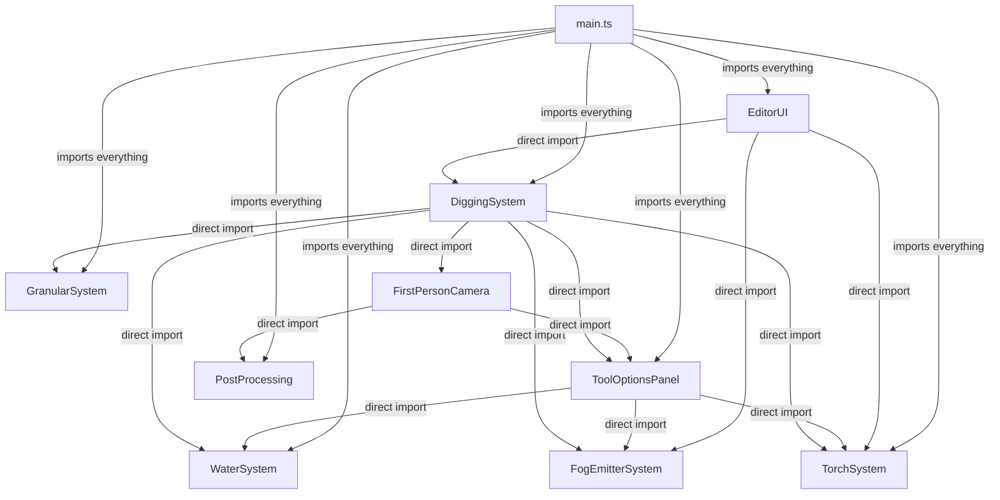
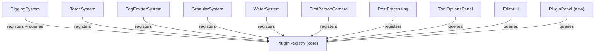

# Plugin Architecture Refactor

## Problem: Current Tight Coupling

The codebase has heavy direct import chains making features inseparable:




**DiggingSystem** is the worst offender: it directly imports 5 other systems and the UI panel.

---

## Target Architecture




Every system registers itself with the `PluginRegistry`. Communication flows through hooks, not direct imports.

---

## New File: `src/core/PluginRegistry.ts`

Central registry with typed hook interfaces. Key responsibilities:

- **Plugin metadata**: id, name, description, category, version, dependencies, status
- **Tool hooks**: `place()`, `remove()`, `getBrushSettings()`, `getToolPanelSliders()` -- queried by blockType
- **Terrain change hooks**: replaces `notifyDigAt()`, `notifyWaterChange()` -- DiggingSystem calls `registry.notifyTerrainChange()`, all registered listeners fire
- **Update hooks**: `onUpdate(dt, scene)` -- replaces DiggingSystem calling `updateTorches()` and `updateFogEmitters()` each frame
- **Save/load hooks**: `getSaveData()` / `loadSaveData()` -- replaces EditorUI importing each system's data functions
- **Undo/redo hooks**: `onUndoRedo()` -- replaces DiggingSystem calling `requestGranularResim()` and `requestWaterResim()`

```typescript
// Key interfaces
interface EditorPlugin {
  id: string;
  name: string;
  description: string;
  category: 'core' | 'rendering' | 'simulation' | 'tool' | 'ui';
  version: string;
  dependencies: string[];

  // Optional hooks
  onTerrainChange?: (x: number, y: number, z: number, radius: number) => void;
  onUpdate?: (dt: number, scene: THREE.Scene) => void;
  getSaveData?: () => { key: string; data: any };
  loadSaveData?: (data: any, scene: THREE.Scene) => void;
  onUndoRedo?: () => void;
  dispose?: () => void;
}

interface ToolPlugin extends EditorPlugin {
  blockType: number;
  place: (...args) => boolean;
  remove: (...args) => boolean;
  getBrushSettings: () => any;
  getToolPanelSliders: () => SliderDef[];
}
```

Singleton export: `pluginRegistry` with methods like `register()`, `getAll()`, `getById()`, `getToolForBlockType()`, `notifyTerrainChange()`, `notifyUndoRedo()`, `gatherSaveData()`, `broadcastLoad()`.

## New File: `src/ui/PluginPanel.ts`

Manages the plugin list panel accessible from the escape menu. Shows:

- All registered plugins grouped by category
- For each: name, description, version, active/inactive status
- Dependencies section: lists each dependency by name with a green/red dot showing if that dependency is present
- Styled in the existing baroque/grimdark theme (Cinzel headers, Crimson Text body, amber accents)

---

## Refactored Files

### 1. `src/systems/TorchSystem.ts`

- **Add**: Self-registration with `pluginRegistry.register()` and `pluginRegistry.registerTool()`
- **Add**: Dependency comment at top: `// Depends on: VoxelWorld (core)`
- **Add**: `getToolPanelSliders()` returning slider definitions (moves slider config out of ToolOptionsPanel)
- **Keep**: All existing logic (placement, particles, soot, etc.)
- **Remove**: Nothing (it's already fairly standalone)

### 2. `src/systems/FogEmitterSystem.ts`

- Same pattern as TorchSystem: self-register, expose tool panel sliders via hook

### 3. `src/systems/WaterSystem.ts`

- **Add**: Self-registration with terrain change hook (replaces `notifyWaterChange()`)
- **Add**: Undo/redo hook (replaces `requestWaterResim()`)
- **Add**: Save/load hooks, tool panel sliders hook
- **Keep**: All simulation logic
- **Export removal**: `notifyWaterChange` and `requestWaterResim` no longer need to be imported by DiggingSystem -- they become internal, triggered via registry hooks

### 4. `src/systems/GranularSystem.ts`

- Same pattern: terrain change hook replaces `notifyDigAt()`, undo/redo hook replaces `requestGranularResim()`

### 5. `src/systems/DiggingSystem.ts` (biggest change)

- **Remove**: Direct imports of TorchSystem, FogEmitterSystem, GranularSystem, WaterSystem
- **Add**: Import only `pluginRegistry`
- **Replace**: `notifyDigAt()` / `notifyWaterChange()` calls with `pluginRegistry.notifyTerrainChange()`
- **Replace**: `placeTorch()` / `removeTorchNear()` etc. with `pluginRegistry.getToolForBlockType(bt).place()` / `.remove()`
- **Replace**: `updateTorches()` / `updateFogEmitters()` with `pluginRegistry.broadcastUpdate(dt, scene)`
- **Replace**: `requestGranularResim()` / `requestWaterResim()` with `pluginRegistry.notifyUndoRedo()`
- **Keep**: Import of FirstPersonCamera (for camera + lock state -- this is a core dependency, declared as such)
- **Keep**: Import of ToolOptionsPanel (for openPanel/isPanelOpen -- UI core dependency)

### 6. `src/systems/FirstPersonCamera.ts`

- **Add**: Self-registration as a core plugin
- **Keep**: PostProcessing and ToolOptionsPanel imports (both are core dependencies, declared clearly)

### 7. `src/ui/ToolOptionsPanel.ts`

- **Remove**: Direct imports of FogEmitterSystem, TorchSystem, WaterSystem
- **Add**: Import `pluginRegistry`
- **Replace**: `buildFogOptions()` / `buildTorchOptions()` / `buildSpringOptions()` with a generic `buildToolOptions()` that queries `pluginRegistry.getToolForBlockType(bt).getToolPanelSliders()` and builds sliders dynamically from the returned definitions

### 8. `src/ui/EditorUI.ts`

- **Remove**: Direct imports of DiggingSystem, TorchSystem, FogEmitterSystem
- **Add**: Import `pluginRegistry`
- **Replace**: `getTorchData()` / `getFogEmitterData()` with `pluginRegistry.gatherSaveData()`
- **Replace**: `loadTorchData()` / `loadFogEmitterData()` with `pluginRegistry.broadcastLoad(data, scene)`
- **Keep**: VoxelWorld/TerrainSurfaceRenderer imports (core infrastructure)

### 9. `src/main.ts`

- **Simplify**: Remove most direct system imports
- **Add**: Import `pluginRegistry` and `initPluginPanel`
- **Keep**: Plugin `.withPlugin()` registration (this is the VibeGame ECS plugin system -- separate from our metadata registry)
- System init calls (`initDigging`, `initGranular`, `initWater`) remain since they wire VoxelWorld/TerrainSurfaceRenderer, but the cross-system coupling is gone

### 10. `index.html`

- **Add**: "Plugins" button in the escape menu center card (under the File section)
- **Add**: Plugin panel HTML container (`#plugin-panel`) -- a scrollable overlay that lists all plugins
- **Add**: CSS for the plugin panel (same baroque theme: dark background, amber accents, Cinzel headers)

---

## Implementation Order

The work is sequenced so the project stays compilable at each step:

1. Create `PluginRegistry.ts` (no existing code depends on it yet)
2. Have each system register itself (additive -- existing imports still work)
3. Refactor consumers (DiggingSystem, ToolOptionsPanel, EditorUI) to use registry instead of direct imports
4. Remove now-unused direct exports/imports
5. Create PluginPanel UI
6. Add Plugin button to escape menu HTML


