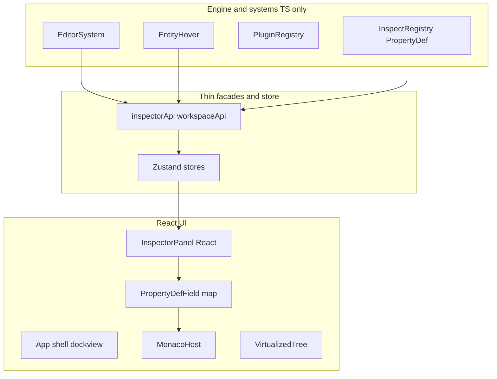

# Full migration: React + dockview + tree + Monaco for editor UI

## Goal

Deliver a **single canonical UI stack**: React renders all editor chrome (docking workspace, panels, menus, overlays, function tabs), using **dockview** for dock/split/tab behavior, **TanStack Virtual + headless tree** (or `react-complex-tree` if you prefer batteries-included) for hierarchy/asset lists, and **Monaco** for text-heavy surfaces. Engine code continues to drive behavior through **stable imperative facades** backed by a **shared client store** (recommended: **Zustand**) so systems like [EditorSystem](src/systems/EditorSystem.ts), [EntityHover](src/editor/EntityHover.ts), and [PropSystem](src/systems/PropSystem.ts) do not import React.

This aligns with [.cursor/rules/immersive-editor.mdc](.cursor/rules/immersive-editor.mdc): live `PropertyDef` editing, gizmos, undo — only the **view layer** changes.

## Touched areas

| Area               | Current                                                                                                                                                                                                                                                                                                | End state                                                                                                                                                                                                        |
| ------------------ | ------------------------------------------------------------------------------------------------------------------------------------------------------------------------------------------------------------------------------------------------------------------------------------------------------ | ---------------------------------------------------------------------------------------------------------------------------------------------------------------------------------------------------------------- |
| Boot               | [main.ts](src/main.ts) calls `initDockingWorkspace`, panel inits                                                                                                                                                                                                                                       | `main.tsx` (or `main.ts`) `createRoot` mounts `<App />`; one-time engine init unchanged                                                                                                                          |
| Dock shell         | [DockingManager.ts](src/ui/DockingManager.ts), [DockingView.ts](src/ui/DockingView.ts), [DockingOps.ts](src/ui/DockingOps.ts)                                                                                                                                                                          | **Deleted**; replaced by dockview layout API + persistence adapter                                                                                                                                               |
| Layout JSON        | [UILayoutStore.ts](src/ui/UILayoutStore.ts) `DockLayoutDocument`                                                                                                                                                                                                                                       | **New** serialized shape from dockview (or mapped 1:1 in adapter); ship a **one-time migration** from old `localStorage` keys to new schema; bump `UI_LAYOUT_SCHEMA_VERSION` or replace with a new key namespace |
| Panels             | [InspectorPanel.ts](src/ui/InspectorPanel.ts) (~2110 LOC), [SettingsPanel.ts](src/ui/SettingsPanel.ts), [PluginPanel.ts](src/ui/PluginPanel.ts), [HistoryPanel.ts](src/ui/HistoryPanel.ts), [AssetBrowser.ts](src/ui/AssetBrowser.ts), [RegisterWorkspacePanels.ts](src/ui/RegisterWorkspacePanels.ts) | React components under e.g. `src/ui/react/panels/`                                                                                                                                                               |
| HTML shell         | [index.html](index.html) large static trees (menu, loading, settings overlay)                                                                                                                                                                                                                          | Slim shell: `#root` (or `#app-root`) for React; keep `#game-canvas` as a **sibling** (Three attaches here — do not let React unmount it)                                                                         |
| Workspace API      | [WorkspacePanelController.ts](src/ui/WorkspacePanelController.ts) → [DockingManager](src/ui/DockingManager.ts)                                                                                                                                                                                         | Thin module `workspaceCommands.ts` calling **dockview API** + Zustand                                                                                                                                            |
| Node graph overlay | [NodeCanvas.ts](src/ui/NodeCanvas.ts) (2D canvas, ~760 LOC)                                                                                                                                                                                                                                            | **Phase decision**: (A) keep canvas imperative, wrap overlay chrome (palette/search) in React; or (B) later migrate graph to **React Flow** — not required for dock/tree/Monaco parity                           |

## Recommended dependency stack

- **react**, **react-dom** (18+)
- **@vitejs/plugin-react** in [vite.config.ts](vite.config.ts)
- **dockview** (`dockview-react`) — dock/split/tabs; strong fit for “Unity-like” workspace
- **zustand** — inspector context, panel visibility, docking commands from non-React code
- **@monaco-editor/react** + `monaco-editor` — scripts, JSON, shader snippets, large `text` `PropertyDef` fields
- **@tanstack/react-virtual** + **@headless-tree/react** (or `@tanstack/react-tree` when stable in your target versions) — virtualized trees for hierarchy and large asset lists
- **@testing-library/react** + **@testing-library/user-event** — component tests for `PropertyDef` rendering

**Alternative tree**: `react-complex-tree` if you want less assembly for drag-reorder; still pair with virtualization for huge trees.

## Architecture (target)

- **Rule**: `src/systems/`** and `src/core/`** import only `**/inspectorApi.ts`, `**/workspaceApi.ts`, never `react`.
- **PropertyDef**: Implement a single `PropertyDefRenderer` that switches on `def.type` and maps to controlled inputs; preserve **gizmo sync** for sliders via `key` + `useEffect` subscribing to external gizmo updates (replace today’s [sliderRefs](src/ui/InspectorPanel.ts) `Map` with ref callbacks or store fields).

## Migration phases (execution order)

### Phase 0 — Tooling and entry

1. Add dependencies and `@vitejs/plugin-react`; enable `jsx: react-jsx` in [tsconfig.json](tsconfig.json); extend ESLint for React hooks (if not already).
2. Introduce `src/ui/react/App.tsx` and mount from entry; initially render only a placeholder layout so the game still boots.
3. Move `#game-canvas` handling: ensure React does not own the canvas node; game view panel is an **empty positioned container** or “hole” where the existing canvas remains full-screen with UI as overlay (match current visual stacking in [src/styles/index.css](src/styles/index.css)).

### Phase 1 — Dock shell + layout persistence

1. Implement `DockingWorkspace` as a dockview root inside `#workspace-root` (replace [UI_ELEMENT_IDS.workspaceRoot](src/ui/UIContracts.ts) usage).
2. Reimplement [createDefaultWorkspaceLayout](src/ui/DefaultWorkspaceLayout.ts) as **dockview default model** (equivalent splits: left settings, center game + bottom assets, right history — match current intent).
3. Replace `WorkspacePanelController` / `DockingManager` exports: `showAndActivatePanel`, `togglePanel`, `dockPanelToGlobalSlot`, `resetDockingLayout`, `setWorkspaceUIVisible` → new implementations using dockview + Zustand.
4. Delete vanilla dock modules once parity is verified.

### Phase 2 — “Simple” panels first

Migrate in this order to reduce risk:

1. **Game view** — empty host verifying tab focus and resize.
2. **Plugin list** — [PluginPanel.ts](src/ui/PluginPanel.ts) is already list-driven from `pluginRegistry`; straightforward React table/cards.
3. **History** — [HistoryPanel.ts](src/ui/HistoryPanel.ts).
4. **Assets** — [AssetBrowser.ts](src/ui/AssetBrowser.ts) + virtualized tree/grid.

### Phase 3 — Inspector (highest risk)

1. Extract **non-UI** logic from [InspectorPanel.ts](src/ui/InspectorPanel.ts): tool context, entity context, NPC layout mode, brush/block palette integration — into `inspectorModel.ts` (pure TS) consumed by hooks `useInspectorContext()`.
2. Build `PropertyDefRenderer` covering all `PropertyDef` variants from [InspectRegistry.ts](src/core/InspectRegistry.ts) (`slider`, `toggle`, `color`, `section`, `subsection`, `button`, `dropdown`, `vec3`, `text`, `readonly`, `progress`, `array`, `curve`, `asset`).
3. Wire **TransformGizmo** / [Gizmos](src/ui/Gizmos.ts): keep imperative; from React, call existing attach/detach APIs in `useEffect` when selection changes.
4. Preserve public exports used across the repo (`refreshInspector`, hover/inspect flows) as wrappers updating Zustand; grep shows callers include [EditorSystem](src/systems/EditorSystem.ts), [EntityHover](src/editor/EntityHover.ts), [PropSystem](src/systems/PropSystem.ts), [CharacterInspector](src/characters/CharacterInspector.ts).

### Phase 4 — Shell overlays: menu, loading, settings, function tabs

1. **Main menu** — [MainMenu.ts](src/ui/MainMenu.ts) (~720 LOC) → React routes/sections; preserve all `data-ui-hint` and [PrewarmBootOptionsUI](src/ui/PrewarmBootOptionsUI.ts) behavior.
2. **Loading screen** — [LoadingScreen.ts](src/ui/LoadingScreen.ts); keep `isLoadingScreenVisible()` as a store-backed flag so [VibeEngine](src/core/VibeEngine.ts) / systems unchanged.
3. **Settings / escape overlay** — [SettingsPanel.ts](src/ui/SettingsPanel.ts) + [RenderingSettingsBuilder.ts](src/ui/RenderingSettingsBuilder.ts); tab panels map to React tabs.
4. **Function tabs** — [FunctionTabs.ts](src/ui/FunctionTabs.ts) → React.
5. **EditorUI** — [EditorUI.ts](src/ui/EditorUI.ts) export/import wiring hooks into React buttons or store actions.

### Phase 5 — Monaco integration

1. Add a dedicated **host component** (e.g. `MonacoField`) used wherever `PropertyDef.type === 'text'` needs language features OR add a **Script / JSON** dock panel for RPG data authoring.
2. Lazy-load Monaco (`import()`) to protect initial bundle; align with Vite worker config if needed.

### Phase 6 — NodeCanvas (optional follow-up)

Defer full port; if needed, wrap overlay root in React and keep 2D canvas; or plan **React Flow** separately — does not block Phases 0–5.

## HMR and immersive-editor compliance

- Replace ad-hoc [HMR bridge in InspectorPanel](src/ui/InspectorPanel.ts) with **React Fast Refresh** for components; keep **Zustand** module singleton stable across HMR (document pattern in code comments).
- [.cursor/rules/immersive-editor.mdc](.cursor/rules/immersive-editor.mdc): re-verify listener cleanup in `useEffect` returns for any document/window listeners moved from vanilla modules.

## Validation

- `npm run check` (tsc), `npm run lint`, `npm run test`
- Manual: dock drag, layout persistence, Tab/double-Tab, inspector E-key flow, gizmo drag, undo slider coalescing, asset browser, world load/save
- **test-runner** subagent: add tests for `PropertyDefRenderer` matrix (at least one case per type)

## Documentation and rules

- Update [docs/editor/Immersive_Editor_Principles.md](docs/editor/Immersive_Editor_Principles.md) (or canonical doc per [llms.txt](llms.txt) map) with “React + dockview” UI architecture.
- Touch [.cursor/rules/immersive-editor.mdc](.cursor/rules/immersive-editor.mdc) **lastReviewed** if editor/HMR section changes.

## Helper routing (subagents / specialists)

| Specialist                | Role                                                                                    |
| ------------------------- | --------------------------------------------------------------------------------------- |
| **explore**               | Final grep sweep for stale `DockingManager` / `InspectorPanel` imports after each phase |
| **ui-programmer**         | React panel structure, dockview integration, accessibility                              |
| **plugin-and-systems**    | Ensure `PluginRegistry` / `ToolPlugin` panel hooks remain correct                       |
| **test-runner**           | Vitest + Testing Library for `PropertyDef` and workspace commands                       |
| **architecture-and-docs** | Doc and `llms.txt` sync                                                                 |
| **verifier**              | End-to-end manual checklist before deleting old modules                                 |

**engine-planning** optional review before Phase 3 if inspector decomposition looks risky.

## Risk notes

- **InspectorPanel** size and gizmo/slider coupling — schedule the largest slice of time here.
- **Layout migration**: users with saved layouts may need reset or automated JSON transform — document in changelog behavior.
- **Bundle size**: React + dockview + Monaco is heavy; use route/lazy splits aggressively.

