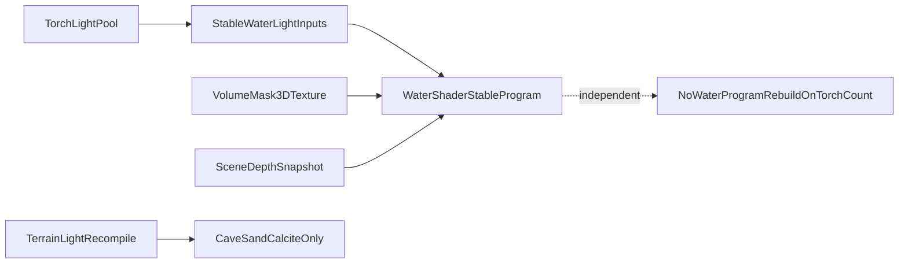

# Water Hitch Refactor Plan

## Chosen Direction

Refactor water so it no longer uses Three.js `lights: true` / `NUM_POINT_LIGHTS` / `NUM_POINT_LIGHT_SHADOWS` shader variants at all. Keep the current water look from its own shader features, but drive torch response through stable custom water-light uniforms or data textures instead of renderer-managed light defines.

This is the best fit for your constraint of fixing the water side only: it removes the root coupling instead of hiding it with caps, prewarm, or torch-specific hacks.

## Why This Plan

The hitch seam is here:

```424:487:d:\Toys\OTHERS\Digging\src\rendering\CaveShader.ts
export function createWaterMaterial(
  deformUniforms: DeformUniforms,
  volumeMaskUniforms?: VolumeMaskUniforms,
): THREE.ShaderMaterial {
  const defines: Record<string, string> = {
    STANDARD: '',
  };
  const uniforms = THREE.UniformsUtils.merge([
    THREE.UniformsLib.lights,
    THREE.UniformsLib.fog,
  ]);
  // ...
  const material = new THREE.ShaderMaterial({
    vertexShader: waterVertSrc,
    fragmentShader: waterFragSrc,
    uniforms,
    defines,
    lights: true,
    fog: true,
```

```598:631:d:\Toys\OTHERS\Digging\src\rendering\TerrainSurfaceRenderer.ts
forceMaterialUpdate(): void {
  this.material.dispose();
  this.sandMaterial.dispose();
  this.lumMaterial.dispose();
  this.waterMaterial.dispose();
  this.calciteMaterial.dispose();

  this.material = createCaveMaterial(...);
  this.sandMaterial = createCaveMaterial(...);
  this.lumMaterial = createLumMaterial(...);
  this.waterMaterial = createWaterMaterial(this.deformUniforms, this.volumeMaskUniforms);
  this.calciteMaterial = createCalciteMaterial(...);
  // ...
}
```

And water currently bakes point-light count into the shader program:

```283:300:d:\Toys\OTHERS\Digging\src\rendering\shaders\water.frag.glsl
#if NUM_POINT_LIGHTS > 0
  vec3 fragViewPos = -vViewPosition;
  #if NUM_POINT_LIGHTS > 1
  for (int i = 0; i < NUM_POINT_LIGHTS; i++) {
  #else
  { int i = 0;
  #endif
    vec3 lVec = pointLights[i].position - fragViewPos;
    float dist = length(lVec);
    // ...
```

So the refactor goal is to make the water program key stay constant as torch count changes.

## Target Architecture




## Implementation Steps

1. Introduce a stable water-light contract.

Files to change:

- `[d:\Toys\OTHERS\Digging\src\rendering\CaveShader.ts](d:\Toys\OTHERS\Digging\src\rendering\CaveShader.ts)`
- `[d:\Toys\OTHERS\Digging\src\rendering\shaders\water.frag.glsl](d:\Toys\OTHERS\Digging\src\rendering\shaders\water.frag.glsl)`
- `[d:\Toys\OTHERS\Digging\src\rendering\shaders\water.vert.glsl](d:\Toys\OTHERS\Digging\src\rendering\shaders\water.vert.glsl)` if varyings need cleanup

Plan:

- Remove `THREE.UniformsLib.lights` from water.
- Set water material `lights: false` while keeping `fog: true` if it does not reintroduce variant churn.
- Replace Three-managed point-light access with a fixed-structure water-light input. Best first version: a small fixed-cap uniform array like `uWaterLights[MAX_WATER_LIGHTS]` plus `uWaterLightCount`.
- Keep depth absorption, fresnel, animated caustics, foam, and base color response entirely in the water shader.
- Keep `USE_VOLUME_MASK` stable instead of making masked/unmasked runtime families.

1. Feed water only the nearby torch data it needs, as data, not as shader variants.

Files to change:

- `[d:\Toys\OTHERS\Digging\src\rendering\TerrainSurfaceRenderer.ts](d:\Toys\OTHERS\Digging\src\rendering\TerrainSurfaceRenderer.ts)`
- `[d:\Toys\OTHERS\Digging\src\systems\TorchSystem.ts](d:\Toys\OTHERS\Digging\src\systems\TorchSystem.ts)` and/or `[d:\Toys\OTHERS\Digging\src\systems\PointLightPoolRuntime.ts](d:\Toys\OTHERS\Digging\src\systems\PointLightPoolRuntime.ts)` depending on current ownership of pooled light positions

Plan:

- Gather a small set of relevant torches for water each frame or each render update.
- Sort/select by proximity to camera or water bounds, not by total global visible light count.
- Upload only positions, colors, radii, and intensity/falloff values needed by the custom water shader.
- Far water remains cheap because the same compiled shader sees low or zero influence, instead of needing a different program.

1. Decouple water from terrain-wide material rebuilds.

Files to change:

- `[d:\Toys\OTHERS\Digging\src\rendering\TerrainSurfaceRenderer.ts](d:\Toys\OTHERS\Digging\src\rendering\TerrainSurfaceRenderer.ts)`

Plan:

- Split `forceMaterialUpdate()` into terrain-lit materials vs stable water material.
- Ensure torch light-count or shadow-count changes do not dispose/recreate `this.waterMaterial` anymore.
- Keep water rebuilds only for true water-shader contract changes such as volume-mask texture lifecycle, shader source changes, or explicit water-quality mode changes.

1. Preserve the current water look before optimizing mask cost.

Files to change:

- `[d:\Toys\OTHERS\Digging\src\rendering\shaders\water.frag.glsl](d:\Toys\OTHERS\Digging\src\rendering\shaders\water.frag.glsl)`
- `[d:\Toys\OTHERS\Digging\src\core\VolumeMask.ts](d:\Toys\OTHERS\Digging\src\core\VolumeMask.ts)` only if mask sampling contract changes

Plan:

- Keep `USE_VOLUME_MASK` behavior functionally intact at first so the refactor isolates lighting from masking.
- Only after hitch removal is verified, consider a second pass to cheapen water-only mask use: for example reduce the six neighbor foam samples near boundaries or replace them with a cheaper heuristic.
- Do not make water partly masked and partly unmasked at runtime; that would create new first-use families.

1. Update debug and contract surfaces.

Files to change:

- `[d:\Toys\OTHERS\Digging\src\rendering\PostProcessing.ts](d:\Toys\OTHERS\Digging\src\rendering\PostProcessing.ts)`
- `[d:\Toys\OTHERS\Digging\references\Engine_Architecture.md](d:\Toys\OTHERS\Digging\references\Engine_Architecture.md)`
- `[d:\Toys\OTHERS\Digging\llms.txt](d:\Toys\OTHERS\Digging\llms.txt)` if water/render ownership contract is described there

Plan:

- Update debug snapshots so water is no longer expected in the dynamic point-light variant family.
- Document that water lighting is now data-driven and stable-program, while terrain still uses renderer-lit variants.

## Likely New File

Create one shared type/adapter file if the light payload would otherwise clutter existing files.

New file to create if needed:

- `[d:\Toys\OTHERS\Digging\src\rendering\WaterLightData.ts](d:\Toys\OTHERS\Digging\src\rendering\WaterLightData.ts)`

Purpose:

- Define strict types for the stable water-light payload.
- Keep the uniform packing / selection logic out of `TerrainSurfaceRenderer.ts`.

## Scope Order

1. Stable water shader with no Three light variants.
2. Water light payload upload and runtime wiring.
3. Remove water from material rebuild path.
4. Optional water-only volume-mask cost reduction after hitch is gone.

## Risks To Manage

- Water may lose some physically-correct torch highlights or shadow fidelity if the custom light path is too simple.
- If fog or other includes still introduce light-count coupling, the hitch class can survive under a different path.
- If water remains in `forceMaterialUpdate()` during transition, the hitch may appear partially improved but not actually solved.
- If the custom water-light cap is too low, appearance can flatten in torch-dense scenes, so the selection heuristic needs to be deliberate.

## Success Criteria

- Torch placement no longer compiles or recreates water materials.
- Water keeps its current identity: depth tint, fresnel, foam, animated surface response, and volume boundary behavior.
- Water response to torches is approximate but visually convincing.
- Any remaining hitch, if present, is no longer attributable to water shader variants.

