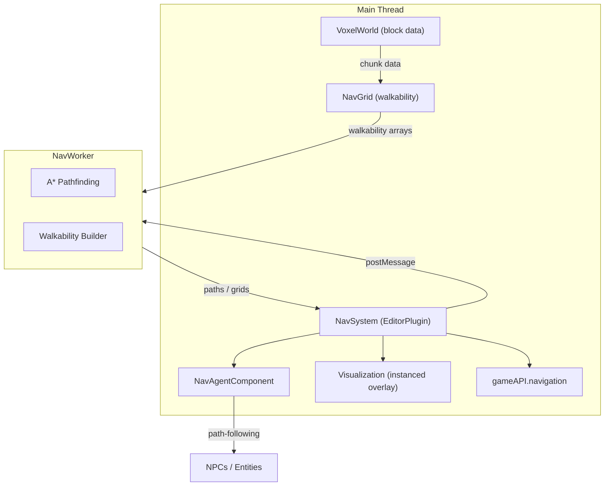

# Voxel Navigation System

## Architecture

The engine's `Engine_Architecture.md` explicitly plans for "A* on voxel grid" (not a traditional triangle navmesh). The voxel grid **is** the navigation mesh. This fits the engine's data-oriented, typed-array design.




## Walkability Rules (Cave-Specific)

A voxel at `(x, y, z)` is **walkable** if:

- `world.get(x, y, z)` is solid (STONE, DIRT, CLAY, SANDSTONE, CRYSTAL)
- `world.get(x, y+1, z)` is AIR (or WATER for wading)
- `world.get(x, y+2, z)` is AIR (2-block clearance for humanoids)

Per-byte flags in the walkability overlay:

- Bit 0: ground-walkable (top-face, 2-block clearance)
- Bit 1: swimmable (WATER above)
- Bit 2: climbable (vertical face exposed -- future, for spiders/insects)
- Bit 3: drop (air below, used for jump/fall edges)

## New Files

### 1. `src/core/NavGrid.ts` -- Walkability grid (Worker-safe, no Three.js)

Pure-math module on typed arrays. Chunk-aligned `Uint8Array` overlays (16x16x16 = 4096 bytes per chunk). Lazy allocation like VoxelWorld.

Key exports:

- `buildChunkWalkability(chunkData, neighbors): Uint8Array` -- compute walkability for one chunk
- `isWalkable(x, y, z): boolean` -- fast lookup
- `getGroundY(x, z): number` -- highest walkable Y at a column (for NPC placement / click-to-move)
- `invalidateRegion(x, y, z, radius)` -- mark chunks dirty after terrain edit
- `getWalkableNeighbors(x, y, z): Vec3[]` -- 18-connected neighbors for A* (cardinal + face-diagonal, plus up/down steps of 1 block)

Memory: ~256 chunks for a 128x64x128 world = ~1 MB. Negligible.

### 2. `src/systems/NavWorkerTypes.ts` -- Shared message types

Following the established `WaterWorkerTypes.ts` pattern:

```typescript
// Main -> Worker
interface NavBuildRequest {
  type: 'build';
  chunkKey: number;
  chunkData: Uint8Array;      // transferred
  neighborData: Uint8Array[];  // top/bottom chunks for clearance checks
  sizeX: number; sizeY: number; sizeZ: number;
}

interface NavPathRequest {
  type: 'pathfind';
  requestId: number;
  walkGrid: Uint8Array;        // transferred (full world walkability)
  fromX: number; fromY: number; fromZ: number;
  toX: number;   toY: number;   toZ: number;
  sizeX: number; sizeY: number; sizeZ: number;
  maxSearchNodes: number;      // budget cap (default 10000)
  allowSwim: boolean;
  allowDrop: boolean;
}

// Worker -> Main
interface NavPathResponse {
  type: 'path';
  requestId: number;
  found: boolean;
  path: Float32Array;          // [x0,y0,z0, x1,y1,z1, ...] transferred
  cost: number;
  partial: boolean;            // true if budget exhausted
}
```

### 3. `src/systems/NavWorker.ts` -- Off-thread A* pathfinding

Web Worker with the standard ping/pong health check. Two operations:

- **Build**: compute walkability for a single chunk (called incrementally on terrain edits)
- **Pathfind**: A* on the walkability grid, returns a smoothed path

A* implementation:

- Binary min-heap for the open set
- `Uint8Array` closed set (flat-indexed)
- 3D octile heuristic: `max(|dx|,|dy|,|dz|) + (sqrt(2)-1)*mid + (sqrt(3)-sqrt(2))*min`
- 18-connected neighbors (6 cardinal + 12 face-diagonal) plus 1-block step-up/step-down
- Budget cap (default 10,000 nodes) -- returns partial path if exceeded
- Path smoothing: iterative line-of-sight pruning (skip waypoint if direct LoS exists between predecessor and successor)

WASM-ready: the A* inner loop is pure math on flat arrays, extractable to Rust later.

### 4. `src/systems/NavSystem.ts` -- EditorPlugin + Visualization

Self-registering EditorPlugin (`pluginRegistry.register(navPlugin)`). Category: `'simulation'`.

**Responsibilities:**

- Owns the `NavGrid` instance and the `NavWorker`
- On world load: builds full walkability grid (dispatched to worker chunk-by-chunk)
- `onTerrainChange(x, y, z, radius)`: invalidates and rebuilds affected chunks
- Queues pathfinding requests, returns promises
- Manages debug visualization overlays

**Visualization (for the human editor):**

- **Walkability overlay**: GPU-instanced small flat quads on walkable voxel tops. Green = walkable, blue = swimmable, orange = drop. Uses `THREE.InstancedMesh` per chunk (same pattern as `VegetationSystem`). Toggle with `**N` key** (or settings slider). Only renders within cull distance.
- **Path debug lines**: When an NPC with a NavAgent is selected (inspected), its current path renders as a glowing `THREE.Line` with animated dashes. Color: warm gold `#FFD080` matching the cave aesthetic.
- **Waypoint markers**: Small diamond shapes at each path node, pulse animation.
- Controlled via escape-menu settings sliders: "Show Nav Grid" (toggle), "Nav Overlay Opacity" (0-1), "Show Paths" (toggle).

**Settings sliders (`getSettingsSliders()`):**

- `showNavGrid`: boolean toggle
- `navOverlayOpacity`: 0.0-1.0 (default 0.3)
- `showPaths`: boolean toggle
- `maxPathNodes`: 5000-50000 (default 10000)

**Save/Load:** persists settings (not the grid itself -- grid is rebuilt from voxel data).

**Events emitted:**

- `nav:grid-ready` -- walkability grid fully built
- `nav:path-found` -- path computed (requestId, entityId)
- `nav:grid-updated` -- region invalidated and rebuilt

**HMR:** full boundary with `import.meta.hot.accept()`, worker passed through `hot.data`.

### 5. `src/components/NavAgentComponent.ts` -- Path-following ComponentDef

Registered with `ComponentRegistry`. Category: `'behavior'`.

**Data shape:**

```typescript
interface NavAgentData {
  speed: number;           // movement speed (default 1.5)
  turnSpeed: number;       // rotation speed (default 3.0)
  pathSmoothing: boolean;  // enable path smoothing (default true)
  allowSwim: boolean;      // can traverse water (default false)
  allowDrop: boolean;      // can drop off edges (default true)
  maxDropHeight: number;   // max fall height in blocks (default 3)
  avoidanceRadius: number; // steer around other agents (default 0.5)
  
  // Runtime (not persisted)
  _path: Float32Array | null;
  _pathIndex: number;
  _state: 'idle' | 'moving' | 'blocked' | 'arrived';
  _targetPos: [number, number, number] | null;
  _requestId: number;
}
```

`**onUpdate(data, ctx, dt)`:**

1. If `_state === 'moving'` and `_path` exists: step along path waypoints at `speed`, interpolate position, rotate toward next waypoint.
2. If reached final waypoint: set `_state = 'arrived'`.
3. If path expired or obstacle detected (terrain changed): request new path.
4. Ground snapping: adjust Y to the actual walkable surface height each frame.

**Inspector properties:**

- Speed, turn speed, swim/drop toggles, avoidance radius
- Read-only: current state, path length, distance to target
- Button: "Navigate to..." (enters click-to-set-destination mode)

**Integration with WanderAI:**

- When a WanderAI entity also has NavAgent attached, wander targets are filtered through `NavGrid.isWalkable()` and movement uses NavAgent path-following instead of direct line movement.
- This is opt-in: entities without NavAgent keep the old simple wander.

### 6. `src/debug/GameAPI.ts` + `GameAPITypes.ts` -- Navigation API

Add a `navigation` namespace to `window.gameAPI`:

```typescript
interface NavigationAPI {
  /** Check if a voxel position is walkable. */
  isWalkable(pos: Position3D): boolean;
  /** Find the ground Y at an X/Z column. Returns -1 if no ground. */
  getGroundY(x: number, z: number): number;
  /** Async: compute a path between two points. */
  findPath(from: Position3D, to: Position3D, options?: PathOptions): Promise<PathResult>;
  /** Command an entity's NavAgent to navigate to a position. */
  navigateTo(entityId: string, target: Position3D): Promise<boolean>;
  /** Check if the nav grid is ready. */
  isReady(): boolean;
  /** Force rebuild of the nav grid (e.g. after bulk edits). */
  rebuild(): Promise<void>;
  /** Toggle nav debug overlay visibility. */
  setDebugOverlay(visible: boolean): void;
}

interface PathOptions {
  allowSwim?: boolean;
  allowDrop?: boolean;
  maxNodes?: number;
}

interface PathResult {
  found: boolean;
  path: Position3D[];
  cost: number;
  partial: boolean;
}
```

## Modified Files

### 7. `src/components/WanderAIComponent.ts`

In the `'wander'` case of `onUpdate`, check if the entity also has a `'nav-agent'` component. If so, delegate movement to the NavAgent's path-following rather than direct line movement. When picking a new wander target, use `NavGrid.isWalkable()` to filter targets and `NavGrid.getGroundY()` to snap to terrain.

### 8. `src/components/index.ts`

Add import and registration of `NavAgentComponent`.

### 9. `src/main.ts`

Add `import './systems/NavSystem.ts';` to trigger self-registration.

### 10. Documentation updates

- `llms.txt` -- Section 6 (Plugin System) and Section 20 (GameAPI): add navigation
- `.cursor/rules/immersive-editor.mdc` -- plugin table, event bus, component list
- `.cursor/rules/engine-architecture.mdc` -- threading architecture, component list
- `docs/engine/Engine_Architecture.md` -- mark pathfinding as implemented
- `docs/editor/Immersive_Editor_Principles.md` -- add NavAgent to component catalog

## Key Design Decisions

- **Voxel grid, not triangle navmesh**: The voxel grid IS the nav data. No external navmesh library needed. This matches the engine's data-oriented design and the explicit plan in `Engine_Architecture.md`.
- **Worker-based A***: Pathfinding never blocks the main thread. Follows the WaterWorker/GranularWorker pattern.
- **Incremental updates**: Only affected chunks are rebuilt on terrain edit (via `onTerrainChange`). No full-world rebuild.
- **Component composition**: NavAgent is a ComponentDef, not hardcoded into CharacterSystem. Any entity (NPC, creature, companion) can have navigation by attaching the component.
- **Effects-off-by-default**: Nav overlay starts hidden. Toggled via escape menu or GameAPI.
- **No external dependencies**: Pure TypeScript A* on flat arrays. WASM-ready for future acceleration.

