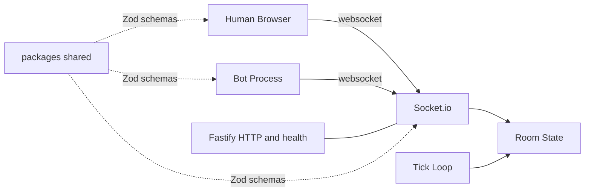

# Architecture

## High-level



## Authority

The server owns:

- per-player **`essenceSpread`** (cumulative spread from bursts + passive), **`tier`**, **`position`** (clamped to a play volume)
- **`planetRadius`** each snapshot: pure function of the **sum of all players’ `essenceSpread`** in the room (including soft-disconnected records until pruned)
- burst cooldowns and rate limits

Clients send **intents** (`cursorMove`, `dropBurst`); the server validates payloads with Zod, applies cooldowns and rate limits, and broadcasts authoritative `RoomSnapshot` and burst events. The client never decides essence spread amounts.

## Wire protocol

The single source of truth lives in [`packages/shared/src/protocol.ts`](../packages/shared/src/protocol.ts):

- `PROTOCOL_VERSION` — bumped on breaking changes; mismatched clients are rejected on hello.
- `EVT.client.*` / `EVT.server.*` — typed event-name constants.
- Zod schemas exported alongside `type X = z.infer<typeof X>`.

```text
client.hello                  -> server.welcome | server.error(protocol_mismatch)
client.intent.cursorMove       (intent only)
client.intent.dropBurst        -> server.event.burst (broadcast) | server.error(rate_limit)
                              <- server.snapshot.roomState (broadcast every tick)
```

## Tick loop

`apps/server/src/net.ts` schedules a `setInterval` at `TICK_HZ` (default 12 Hz). Each tick:

1. `Room.tick()` advances passive essence spread for connected players.
2. A `RoomSnapshot` is built and broadcast.
3. Every `tickHz * 10` ticks the server emits a `room.tick` log line summarizing `essenceSpreadSum`, `planetRadius`, and player count for low-frequency observability.

## Rendering (client)

`apps/client/src/scene.ts` runs a Three.js loop:

- Icosphere planet, scaled by `snap.planetRadius`.
- Additive atmosphere shell.
- Starfield (1200 points).
- Pooled particle field (max 6144) with simple gravity toward origin.
- Local spirit walks the planet in surface space; remotes follow snapshots.
- Remote spirits added/removed from snapshots.

## Repository conventions

- **Always-applied rules**: see [`.cursor/rules/`](../.cursor/rules/).
- **Strict TypeScript**: `noUncheckedIndexedAccess`, no `any`.
- **One canonical name per concept**: `essenceSpread`, `spiritTier`. Update everywhere on rename (see `migration-and-terminology` agent).
- **No deprecated event aliases** unless the team explicitly approves.
