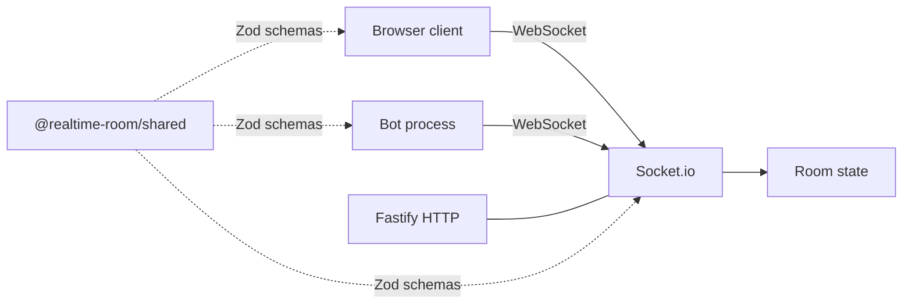

# Architecture

## Overview

## Authority

The server owns player records (`id`, `displayName`, `isBot`, `position` clamped to the play volume), **room settings** (e.g. shared room note), and the monotonic **tick** counter included in each snapshot. Clients send **intents** only (`move`, `roomSettingsPatch`); payloads are validated with Zod before mutating room state.

## Wire protocol

Canonical definitions: [`packages/shared/src/protocol.ts`](../packages/shared/src/protocol.ts).

- `PROTOCOL_VERSION` — increment on breaking wire changes; hello rejects mismatches.
- `EVT.client.*` / `EVT.server.*` — typed event names.
- Typical flow: `client.hello` → `server.welcome` + `server.snapshot.roomState` → streaming `client.intent.move` and periodic `server.snapshot.roomState`.

## Tick loop

`apps/server/src/net.ts` schedules `setInterval` at `TICK_HZ` (default 12). Each tick: `Room.tick()`, build `RoomSnapshot`, broadcast to the room. Periodic structured logs summarize player count and tick.

## Client

`apps/client/src/scene.ts` renders a minimal Three.js world (grid, spheres). `net.ts` validates snapshots with the shared schema. `options.ts` drives the ESC session UI for room settings patches.

## Dev persistence

When enabled (non-production by default), `apps/server/src/persistence.ts` writes `Room.serialize()` to JSON on an interval and on shutdown so `tsx watch` restarts keep soft-disconnected records until pruned.

## Conventions

- Strict TypeScript, no `any`.
- One canonical name per concept across packages.
- Player-visible copy stays short and non-technical (see `.cursor/rules/player-facing-copy.mdc`).
