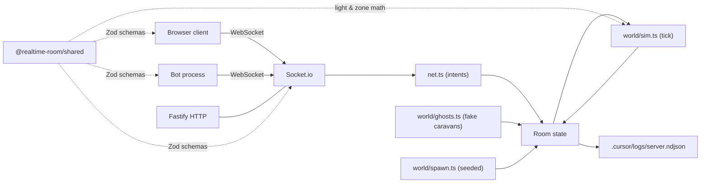

# Architecture

**White Exile** — authoritative multiplayer caravan simulation.

## Overview

## Authority

The server owns:

- **Players** (`id`, `displayName`, `isBot`, `race`, `position`, `fuel`, `relicBonus`, attached `followers`)
- **Followers** (`kind`, `position`, `ownerId`, `morale`)
- **Ruins** & **Relics** (procedural; activated/claimed flags)
- **Caravans** (recomputed each tick from light-field overlap)
- **Settings** (shared room note) + monotonic **tick** counter

Clients send **intents** only: `move`, `roomSettingsPatch`, `rescue`, `activateRuin`. Every payload is validated with Zod. `move` positions are accepted as `Vec3` but the room applies `clampPlayerPosition` (snap inside the play sphere, then Y onto the shared ash-dune surface plus avatar offset) for humans, restored players, external bots, and internal ghosts. Dune relief amplitude is controlled by `WorldConfig.duneHeightScale` (broadcast in welcome + snapshots; client shader uses the same factor).

## Wire protocol

Canonical definitions: [`packages/shared/src/protocol.ts`](../packages/shared/src/protocol.ts) and [`world.ts`](../packages/shared/src/world.ts).

- `PROTOCOL_VERSION = 2`. Hello rejects mismatches.
- `EVT.client.*` / `EVT.server.*` event names.
- Snapshot shape: `serverTime`, `tick`, `settings`, `worldConfig`, `players[]`, `followers[]`, `ruins[]`, `relics[]`, `caravans[]`.

## Tick loop (server, default 12 Hz)

[`apps/server/src/world/sim.ts`](../apps/server/src/world/sim.ts) does, in order:

1. **Solo light radius** per player via `computeSoloLightRadius` (race base + diminishing follower bonus + relic bonus, multiplied by **fuel in [0,1]** and zone multiplier).
2. **Caravan formation** via `buildCaravans` — union-find over light-field overlap pairs.
3. **Relic claim** for unclaimed relics within range.
4. **Fuel step** via `stepFuel` (decay if alone, recover when sheltered by a multi-member caravan or inside an active ruin).
5. **Follower follow** — attached followers lerp toward an owner-relative slot; morale drops if owner fuel is low; below threshold they desert.
6. **Rescue intents** — attach the nearest stranded follower inside the player's solo light radius.
7. **Ruin activations** — flip the ruin and spawn its follower charge nearby.
8. **Combat absorption** — for any player pair whose light fields overlap with a brightness ratio ≥ 1.25, the brighter player drains the dimmer's fuel and may steal a follower.

Pure-data results (`derived`, `caravans`, counters) feed `Room.snapshot()`.

## Internal sim ghosts

[`world/ghosts.ts`](../apps/server/src/world/ghosts.ts) holds 0..N fake caravans (default 4) directly inside `Room.players`. They wander between zones, occasionally queue a rescue intent, and despawn when real (non-bot) player count meets `GHOST_REAL_CAP`.

## Client

- [`scene.ts`](../apps/client/src/scene.ts) renders ground + grid, race-tinted local core with a halo whose scale tracks the server's `lightRadius`, race-tinted markers + haloes for other players, follower spheres, ruin pillars (warm glow when activated), and rotating relic octahedrons. The ash dune ground `castShadow`s and receives; [`duneTerrainMaterial.ts`](../apps/client/src/duneTerrainMaterial.ts) attaches matching `customDepthMaterial` / `customDistanceMaterial` so sun and torch shadow maps use the same displacement as the visible mesh. CSS2D labels (**T** = off → keywords → full) use [`worldLabels.ts`](../apps/client/src/worldLabels.ts) and [`tooltips.ts`](../apps/client/src/tooltips.ts) for mode persistence. Only the five nearest other players, followers, ruins, and relics (by distance to the local caravan) show labels; your own label and the ground hint always show when labels are on.
- Lighting model is moon-gold sun under thick fog (sky + directional match):
  - [`sky.ts`](../apps/client/src/sky.ts) — back-faced sphere with a custom shader (height gradient + horizon haze + smothered sun disk + drifting noise band). Reacts to zone via `setZoneTone`.
  - [`flameLighting.ts`](../apps/client/src/flameLighting.ts) — `HemisphereLight` (cool sky / warm ash ground), low `AmbientLight` (uniform fill kept small so the moon-gold `DirectionalLight` gives readable lit vs shaded sides on props), one shadow-casting `DirectionalLight` (world-fixed ortho shadow frustum), one shadow-casting `PointLight` on the local player (radial **cube** shadow — one map across full torch reach, so map size + PCF softness matter for small casters like followers), and a preallocated pool of 8 `PointLight`s for other players' flames (the first 3 cast shadows on `high`). Each "flame" is a custom additive shader on crossed quads with vertical noise + flicker; `PointLight` intensity uses a subtler flicker so wide torch falloff does not strobe the whole scene. **`low` tier disables torch point shadows** (sun shadows off too). The renderer uses ACES tone mapping and sRGB output; `FogExp2` density on the client is scaled slightly below the server canonical value so mid-distance terrain is not crushed to black. Fog can be turned off in the ESC Session → Graphics tab (`rtRoom.fog` in `localStorage`); the **Fill** slider there scales sun + hemisphere + ambient together for a brighter, flatter look if desired.
  - Graphics quality tier (`low` / `med` / `high`) is set in the ESC menu and toggles shadows + map sizes live without recreating lights. Backed by `localStorage.rtRoom.fx`; **no URL parameter** exists for it (or any other tunable).
- Fog density is still set per zone using `fogDensityForZone`; sky tone, ground emissive, hemisphere intensity, and clear color also shift per zone via `zoneIntensityScale`/`zoneClearColor`/`zoneGroundColor` in [`scene.ts`](../apps/client/src/scene.ts).
- Local prediction for movement; server clamps and rebroadcasts.
- **Esc** opens a compact tabbed Session dialog ([`options.ts`](../apps/client/src/options.ts)): identity, graphics (quality, labels, fog/fill/exposure/sky haze, **torch reach** multiplier `rtRoom.torchReachMul` (client-only: scales PointLight `distance`, linear `decay`, a mild intensity boost, and slightly thins exponential scene fog so distant flames read), **dune height** → `roomSettingsPatch.duneHeightScale`), and Help. The room note is HUD-only. In-world labels can still surface **R** / **F** when you are close to a stranded follower (inside your light) or an inactive ruin.

## Dev persistence

When enabled (non-production by default), [`persistence.ts`](../apps/server/src/persistence.ts) writes `Room.serialize()` (players, followers, ruins, relics, settings, seed) to JSON every 5s and on shutdown. Restores before listening so reconnects survive `tsx watch` restarts.

## Logging

`logger.ts` builds a Pino multistream:

- pretty stdout when running in a TTY
- NDJSON to `.cursor/logs/server.ndjson` (toggle via `LOG_TO_FILE`)

Both streams receive identical structured records, including `evt`, `playerId`, `traceId`, `roomId`, and any sim-specific fields (`followerId`, `ruinId`, `winnerId`, `winnerLight`, etc.).

## Conventions

- Strict TypeScript, no `any`, explicit return types on exported functions.
- One canonical name per concept across packages.
- Player-visible copy stays short and non-technical.
